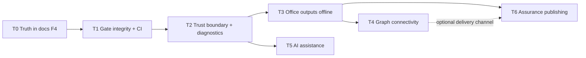

# PSPF Grand Plan

Status: **active — planning authority for remediation and the connected-capability programmes**
Last updated: 2026-06-10 (repo version 1.41.4)

## Purpose

This is the single forward plan for the PSPF ecosystem. It sequences two streams of work:

1. **Remediation** of the findings from the June 2026 ecosystem architecture/UX review (findings F1–F7; see `/memories` note `ecosystem-review-2026-06` and the tranche descriptions below, which are self-contained).
2. **New capability programmes**: Microsoft 365 / Graph integration, AI assistance with a mandatory kill switch, and a secure assurance-publishing step.

The ordering principle is deliberate: **make the documentation truthful first (F4), then close the trust boundary, then build new features on top of a boundary we trust.** New connected features (Graph, AI) must not land on an import/diagnostics layer that cannot validate or explain failures.

This plan does not override the authority chain in `pspf-spec-consistency-index.md`. Every tranche below that changes architecture, schema, or invariants **starts with an ADR**; this document records the sequence and the design constraints, not the decisions themselves.

## Hard constraints (apply to every tranche)

1. **Offline-first is preserved.** The four shipped extensions (Core, Workshop, Shop, Pub) remain fully functional with zero network access. All connected capability ships as separately installable, default-off surfaces. No existing workflow may acquire a network dependency.
2. **Default-deny publication policy applies to every new field and every new output channel** (Graph payloads, AI prompts, assurance artefacts). Anything leaving the device passes through `sanitiseEntityForPublication` or an equivalent allowlist that throws on unknown fields.
3. **Kill switches are policy, not preference.** AI and Graph capability must each be disableable at three levels: per-user setting, workspace policy (`.pspf/config/policies.json`), and build-time exclusion (the extensions function identically when the capability package is absent). Disabled means *no code path can reach the network or a model* — not a hidden toggle.
4. **Post-quantum cryptography from day one for any new signing or encryption.** The ecosystem currently uses SHA-256 checksums only (acceptable). The moment assurance publishing introduces signatures, use ML-DSA (FIPS 204) or SLH-DSA (FIPS 205); any key establishment uses ML-KEM (FIPS 203) hybrid. No new Ed25519/ECDSA/RSA surface is introduced.
5. **AU English in all user-facing copy**; every spec touched gains a `Status: implemented | partial | aspirational` header.

---

## Tranche 0 — Truth in documentation (F4) — **first, before any other work**

Outcome: specs, agent instructions, and indexes describe v1.41 reality; aspiration is labelled as aspiration.

| # | Work item | Done when |
| --- | --- | --- |
| 0.1 | Rewrite `.github/copilot-instructions.md` to describe the current 11-package, shipped-to-Marketplace reality (Shop and Pub are live; Explorer is dual-mode; current commands and gates). | Agent instructions match `package.json` and the package tree. |
| 0.2 | Add `Status: implemented / partial / aspirational` headers to all root specs, starting with `pspf-error-and-diagnostics-model.md` (aspirational), `pspf-migration-safety-runbook.md` (aspirational), `pspf-developer-pipeline-spec.md` (partial). | Every root spec carries a status header. |
| 0.3 | Add a spec-drift gate: greps spec-declared identifiers (e.g. `PSPF_*` error codes, mandated limits) against `packages/*/src`; specs marked `implemented` with missing identifiers fail CI. | `check:spec-drift` in `check:gates:run`. |
| 0.4 | Repair ADR hygiene: regenerate `adr/README.md` index (0070+ are unindexed), renumber the duplicate ADR 0069, backfill or waive ADRs for v1.38/v1.40/v1.41. | Index complete; no duplicate IDs. |
| 0.5 | Fix hardcoded version strings (README says 1.41.1) — derive from `package.json` during release readiness, or assert equality in `check-release-candidate.mjs`. | Version drift is gate-checked. |
| 0.6 | Execute or formally amend ADR 0013's `docs/` move decision (root sprawl currently contradicts the recorded decision). | ADR and reality agree, whichever way. |

## Tranche 1 — Gate integrity and CI/actions optimisation (F2 + CI review)

Outcome: gates that detect their own failure; a CI pipeline that runs the tests, builds once, and finishes fast.

| # | Work item | Done when |
| --- | --- | --- |
| 1.1 | Restore `scripts/check-adr-coverage.mjs` from git history (`19e2fbf`, truncated to 0 bytes in merge `fb9d442`). | Gate executes and asserts again. |
| 1.2 | Add a **meta-gate**: every `check-*.mjs` referenced by the gate runner must be non-empty, parse, and emit a machine-readable `assertions: N` line with N > 0; the runner fails otherwise. | An emptied gate file fails CI. |
| 1.3 | Replace the `e2e:vX.Y` linked-list scripts and the 35-entry version map in `check-release-candidate.mjs` with a single data-driven `release-gates.json` (version → gate list) consumed by one runner that **builds once** and executes gates in parallel groups with per-gate timing output. Repairs the missing `e2e:v1.15` hole class permanently. | One manifest, one runner; `package.json` scripts shrink; release readiness wall-clock drops materially. |
| 1.4 | Add `pnpm test` (all nine package `node --test` suites) to `ci.yml`; add the pnpm store cache that `marketplace.yml` and `web-release.yml` already have. | Unit tests run on every PR. |
| 1.5 | CI honesty: align `pspf-developer-pipeline-spec.md`'s claimed status checks with what `ci.yml` actually runs (or vice versa); document the Linux-only matrix as deliberate. | Spec and workflow agree. |

## Tranche 2 — Trust boundary and diagnostics (F1 + F3 + diagnostics review)

Outcome: import is as disciplined as export; every failure is structured and explicable. **Prerequisite for Graph and AI tranches** — connected features generate exactly the kinds of failures (auth, network, quota, malformed remote data) that the current raw-`Error` model cannot express.

| # | Work item | Done when |
| --- | --- | --- |
| 2.1 | Implement the diagnostics model: `PspfError` in `packages/contracts` carrying `code / severity / category / retryable / recommendedAction` per `pspf-error-and-diagnostics-model.md`; convert the ~40 raw throws in `core/service.ts`; add try/catch + output-channel logging to every contributed command. Spec status moves aspirational → implemented. | Error codes exist in source; gates assert on codes, not message prose. |
| 2.2 | Import-side validation in Core (`buildImportPlan`): read the manifest first; refuse incompatible major versions with guidance (`PSPF_VERSION_UNSUPPORTED`); verify per-collection SHA-256 hashes; run the same ajv schemas the gates use; enforce the spec's size/count/depth limits (`PSPF_IMPORT_LIMIT_EXCEEDED` becomes real); validate the entity envelope before any SQL. | A truncated, tampered, oversized, or future-major bundle is rejected with a structured, actionable message. |
| 2.3 | One shared compatibility function in `packages/contracts`, used identically by Core import, Explorer load, and the gates. Explorer validation failures **block rendering** behind an explicit "Review anyway" acknowledgement. Consume or delete the never-read `compatibility.*` manifest block. | One answer to "is this bundle compatible?" across all surfaces. |
| 2.4 | Durability fixes in Core: atomic stale-lock takeover (rename-based claim + boot-time alongside pid), lock release in `deactivate()`, "Force Unlock" command, fsync in `persistSqlDatabase`, honest snapshots (real DB copies, rotated), working `full-replace` undo. | The two-writer data-loss scenario and the unrecoverable-rollback gap are closed. |
| 2.5 | Migration skeleton: on open, compare stored `schemaVersion` with `VERSION_AXES`; refuse-with-guidance or run registered migrations from the (currently empty) `migrations/` directory. `pspf-migration-safety-runbook.md` moves aspirational → partial. | Extension upgrades against an older DB are detected, never silent. |

## Tranche 3 — Office outputs, offline first (Graph programme, phase G1)

Outcome: Word, Excel, and PowerPoint outputs **without any network dependency**, satisfying most of the "output to Office" goal inside the existing offline-first invariant.

Design position: producing `.docx` / `.xlsx` / `.pptx` files is OOXML file generation — it requires no Microsoft Graph, no account, and no network. This phase delivers the highest-value Office capability with zero policy risk, and de-risks phase G2 by settling the document templates and redaction rules first.

| # | Work item | Notes |
| --- | --- | --- |
| 3.1 | ADR: Office document export architecture — new `packages/office-render` (sibling of `brief-renderer`), pure OOXML generation, no runtime network, library choice recorded (prefer a minimal, auditable dependency; weigh `docx`/`exceljs`/hand-rolled OOXML against supply-chain posture). | Constraint 2 applies: documents are built **only** from publication-sanitised projections. |
| 3.2 | Word: posture brief and assurance report as `.docx` (reuse `brief-renderer` content model). PowerPoint: executive posture pack (summary, posture donut, top risks, plan-on-a-page). Excel: requirements/obligations/actions registers with status columns. | Templates carry classification markings from the manifest, generation timestamp, and version provenance on every artefact. |
| 3.3 | New gate `check:office-redaction`: generated documents are unzipped and scanned with the same disallowed-field walker as `check-personal-data-exclusion.mjs` (OOXML is ZIP+XML — the existing scanner pattern applies directly). | Redaction parity with the bundle boundary. |
| 3.4 | Commands: "Export Posture Brief (Word)", "Export Executive Pack (PowerPoint)", "Export Registers (Excel)" in Workshop, with the same save-dialog conventions as bundle export. | Stays within native VS Code UX. |

## Tranche 4 — Microsoft Graph connectivity (Graph programme, phase G2)

Outcome: opt-in two-way Outlook integration and Teams publishing, in a **separate extension**, without weakening the offline-first product.

Design position: connectivity lives in a new fifth extension (working name `pspf-connect`), so the four shipped extensions remain network-free by construction (constraint 3's build-time exclusion is satisfied by non-installation). `pspf-connect` talks to Core only through the existing `pspf.core.*` command API, like every other satellite.

| # | Work item | Notes |
| --- | --- | --- |
| 4.1 | ADR: connected-capability architecture — `pspf-connect` extension boundary; MSAL via VS Code's built-in Microsoft authentication provider; **delegated permissions only, least privilege** (`Mail.ReadWrite`, `Mail.Send`, `ChannelMessage.Send`, `Files.ReadWrite` as needed, requested incrementally); no client secrets in the repo or the extension; tokens held by VS Code's secret storage only. | Threat model (`pspf-threat-model.md`) gains a connected-boundary section **before** code lands. |
| 4.2 | Kill-switch implementation per constraint 3: `pspf.connect.enabled` setting + `policies.json` workspace policy + the extension simply not being installed. A visible status indicator shows connected/disconnected/disabled-by-policy. New gate `check:connect-kill-switch` proves no network call site is reachable when disabled (static analysis of the dist bundle for `fetch`/Graph client behind the policy guard). | Disabled-by-policy must be indistinguishable from not-installed in behaviour. |
| 4.3 | Outbound: send posture brief / assurance report as Outlook mail (Graph `sendMail`) and post to a Teams channel — payloads built exclusively from the tranche-3 sanitised document pipeline. Every outbound send is recorded as a change-record entity (what, when, to where, by which identity) for auditability. | Trust requirement: operators in this domain must be able to evidence every disclosure. |
| 4.4 | Inbound: capture an Outlook message (or attachment) as Evidence — explicit user-initiated pull (pick a message → create Evidence with provenance metadata), never background sync. Inbound content is treated as untrusted input and passes the tranche-2 validation/limits stack. | No background processes; local-first remains literal. |
| 4.5 | Failure UX: all Graph errors surface as `PspfError` codes (`PSPF_CONNECT_AUTH_EXPIRED`, `PSPF_CONNECT_THROTTLED`, …) with recommended actions; offline simply means the connect surface shows "offline — nothing queued", never a broken state. | Depends on tranche 2.1. |

## Tranche 5 — AI assistance with a mandatory kill switch

Outcome: AI that accelerates expert work without ever being a dependency, a data leak, or present at all in non-AI environments.

Design position: AI capability lives behind a single contracts-level gate consulted by every feature (`isAiEnabled(): boolean` reading setting + workspace policy + capability presence). Prefer the **VS Code Language Model API** (`vscode.lm`) as the first provider: it inherits VS Code's own consent UX, works with the user's existing Copilot entitlement, requires no API keys in our code, and is absent in restricted environments — which makes "degrade gracefully" the default. A remote-API provider, if ever added, is a separate ADR with its own data-handling assessment.

| # | Work item | Notes |
| --- | --- | --- |
| 5.1 | ADR: AI capability boundary — provider abstraction, the three-level kill switch (constraint 3), and the **prompt redaction rule**: anything sent to a model passes the same publication sanitiser as an export; `restricted` fields can never appear in a prompt. | The kill switch and prompt-redaction rules are invariants (add to `pspf-invariants.md`). |
| 5.2 | New gate `check:ai-kill-switch`: with policy disabled, no `vscode.lm` / model-provider call site is reachable (dist-level static check) and all AI commands/views hide via `when` clauses keyed to a context value. | A non-AI environment shows no AI affordances at all — not greyed-out buttons. |
| 5.3 | First features (all draft-and-confirm; AI output is never persisted without explicit human acceptance, and persisted records carry a `machineAssisted: true` provenance flag): (a) draft evidence summaries from raw notes; (b) suggest Requirement ↔ ISM control mappings with confidence rationale (human review uses the existing MAP review metadata); (c) plain-language posture-brief narrative drafting. | Mapping suggestions slot into the existing ADR 0019/0020 review workflow rather than inventing a new one. |
| 5.4 | Provenance UX: machine-assisted records are visibly labelled in Workshop and in published artefacts ("Drafted with AI assistance, reviewed by operator") — in this domain, disclosure builds trust; silence destroys it. | AU-English copy per glossary. |

## Tranche 6 — Assurance findings and secure publishing

Outcome: a first-class assurance step — author findings, get them sign-off-ready, and publish them with integrity guarantees a recipient can verify.

| # | Work item | Notes |
| --- | --- | --- |
| 6.1 | ADR: assurance finding model — new `assurance-finding` entity (`AFD-` prefix per ADR 0002 conventions): finding, severity, affected requirements/controls (existing link taxonomy), recommendation, management response, status (draft → review → approved → published). Every field declares `publication` policy; management responses and reviewer identities default `sensitive`/`restricted`. | Extends the entity-link spec; new collection added to the bundle schema with a minor `schemaVersion` bump. |
| 6.2 | Workshop assurance workbench: author findings, link evidence, run the review/approval state machine, and assemble an **assurance report** (reusing tranche-3 Word/PowerPoint outputs and the existing brief pipeline). | Approval transitions are change-recorded for auditability. |
| 6.3 | **Signed publication (PQC, constraint 4)**: published assurance bundles gain a detached attestation — canonical serialisation of the manifest + collection hashes, signed with **ML-DSA-65**; verification key fingerprint displayed in Workshop and on the landing page. Explorer's existing Bundle Validation panel gains a "Signature: verified / not present / FAILED" row (WebAssembly or JS ML-DSA verifier; verification failure **blocks** rendering per tranche 2.3). | This is the moment cryptography enters the ecosystem; the ADR records key generation, storage (VS Code secret storage / OS keychain), rotation, and the explicit decision *not* to use classical signatures. |
| 6.4 | Secure delivery options, in order: (1) signed bundle file via existing export (works offline, default); (2) signed bundle to a recipient via `pspf-connect` (Outlook/Teams, tranche 4 — optional); (3) Explorer publication with the assurance section honouring the finding-level publication policy. | No new server-side component; the static-hosting trust model is preserved. |
| 6.5 | Gates: `check:assurance-redaction` (findings respect publication policy in every artefact) and `check:attestation-roundtrip` (sign → tamper → verify-fails; sign → verify-passes). | Same control-fixture pattern as the personal-data gate. |

---

## Sequencing and dependencies

- T0 and T1 are small and immediate; nothing else starts until both are done (they are what makes the rest verifiable).
- T2 is the load-bearing tranche: structured diagnostics and a closed import boundary are prerequisites for every connected feature.
- T3 before T4: most "Office integration" value needs no network; settle templates and redaction offline before any token touches the system.
- T5 can run in parallel with T3/T4 once T2 lands (it shares only the diagnostics and policy infrastructure).
- T6 lands last because it composes the document pipeline (T3), optionally the delivery channel (T4), and introduces the first cryptography.

## UX and polish work folded into tranches

The review's UX findings are scheduled inside the tranches that touch the same surfaces, not as a separate stream: marketplace metadata (icons/categories/keywords) and the Explorer remembered-bundle "forget" control + cache-busting ship with T1 (release-engineering work); native onboarding (`viewsWelcome`, walkthroughs), Workshop command rationalisation, and the shared CSP webview shell migration ship with T2/T3 (the surfaces being modified anyway); the Pub rename and de-jargoning ship with the first tranche that next touches each extension.

## Governance

- Each tranche opens with its ADR(s) before implementation; `check:adr-coverage` (restored in T1) enforces linkage.
- Each tranche defines its gates before its features; a tranche is done when its gates run in `check:gates:run` via the T1 manifest.
- `pspf-spec-consistency-index.md` gains rows for new specs (connect, AI capability, assurance model) as their ADRs land.
- This plan is reviewed at each minor release; completed tranches are marked here rather than deleted, preserving the decision trail.
