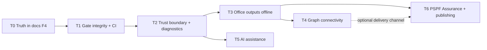

# PSPF Grand Plan

Status: **active — planning authority for remediation and the connected-capability programmes**
Last updated: 2026-08-25 (repo version 1.61.0)

## Purpose

This is the single forward plan for the PSPF ecosystem. It sequences two streams of work:

1. **Remediation** of the findings from the June 2026 ecosystem architecture/UX review (findings F1–F7; see `/memories` note `ecosystem-review-2026-06` and the tranche descriptions below, which are self-contained).
2. **New capability programmes**: Microsoft 365 / Graph integration, AI assistance with a mandatory kill switch, the PSPF Assurance extension, and a secure assurance-publishing step.

The ordering principle is deliberate: **make the documentation truthful first (F4), then close the trust boundary, then build new features on top of a boundary we trust.** New connected features (Graph, AI) must not land on an import/diagnostics layer that cannot validate or explain failures.

This plan does not override the authority chain in `pspf-spec-consistency-index.md`. Every tranche below that changes architecture, schema, or invariants **starts with an ADR**; this document records the sequence and the design constraints, not the decisions themselves.

## v1.61 release hardening

Status: **implemented — governed by ADR 0095**

The v1.61 release closes the Workshop persisted-value rendering, Core full-replace, writer-lock, Explorer exchange, and backup/restore findings from the release review. The durable regression contract is `check:release-hardening`: hostile and missing Workshop values are exercised through runtime helpers; full-replace is complete, strict, atomic, failure-rollback tested, and undoable; writer contention and stale recovery run across processes; Explorer emits a complete canonical bundle; and cold restore proves fresh ownership before writing. This is a reliability/security release only, so all compatibility axes remain `1.15.0`.

## Operational plan: compliance uplift workflow (next few days)

Status: **active — next-slice direction**

The immediate product focus is the requirement-to-action journey in Explorer/Workshop. The user feedback is clear: the tool is already effective as a review surface, but the real value is the uplift loop — turning PSPF outcomes into justifiable decisions, standard mitigation language, and a practical work plan for the next cycle.

### Decisions now in force

1. **Product framing:** Explorer is a compliance uplift tool. We can describe it as: compliance uplift, assurance uplift, remediation workflow, or control improvement work-planning surface. The core message is consistent: the tool helps move from assessment to action.
2. **Standard mitigation guidance:** yes, we build this. The product should offer standardised mitigation patterns derived from ISM-aligned controls and allow operators to tailor those patterns without losing the control rationale.
3. **Action generation:** yes, we add assisted action generation. The system should draft suggested actions for unmet or risk-managed requirements, but keep the operator in control of acceptance, editing, and prioritisation.
4. **Simplify after proving the pattern:** we will not over-automate the workflow upfront. We will validate the assisted model, then reduce effort and simplify the experience once the pattern is stable.
5. **Primary value:** the product is not just a reporting tool; it is a bridge between compliance status, evidence, mitigation, and forward work planning.

### Product outcome to target

The product should help a user answer five questions in sequence:

1. What is the current control or requirement state?
2. Why is it in that state, and what evidence supports it?
3. What mitigation is standard and appropriate?
4. What action is needed next, and what is the impact if it is not tackled?
5. What goes onto the forward work plan for the next review cycle?

### Implementation sequence for the next few days

| Phase | Focus                                 | Objective                                                                                                                    |
| ----- | ------------------------------------- | ---------------------------------------------------------------------------------------------------------------------------- |
| 1     | Decision clarity and evidence capture | Make the requirement detail flow explicit and defensible with clear status choices and required rationale/evidence logs.     |
| 2     | Standard mitigation library           | Add suggested mitigations that are structured, tailorable, and aligned to the underlying control family or requirement type. |
| 3     | Assisted actions                      | Convert unresolved or risk-managed items into draft actions for review and acceptance.                                       |
| 4     | Priority and work-plan views          | Show which items matter most, what the impact is, and how they feed the next-year uplift plan.                               |

### Scope boundaries for this slice

- In scope: requirement decision capture, evidence and rationale, mitigation suggestions, assisted action generation, impact statements, prioritisation, forward work-plan linkage.
- Out of scope for now: full project-management automation, predictive analytics, AI-generated action plans without human review, and creating a separate PM platform.

### Working principle

The product must support the operating cycle of:

- assess
- justify
- mitigate
- prioritise
- plan

not merely the reporting cycle of:

- record status
- show charts
- export a summary

### Immediate operating tasks

- Validate the current requirement journey and where the user loses momentum between status and next action.
- Agree the required decision states and the minimum evidence/rationale for each.
- Prototype a standard mitigation suggestion flow.
- Test the assisted action-generation pattern on a real requirement set.
- Confirm the minimum outputs needed for a forward work plan and leadership review.

This short operating plan sits alongside the longer architecture and remediation tranches above and should be revisited after the next working cycle.

## Hard constraints (apply to every tranche)

1. **Offline-first is preserved.** The five local extensions (Core, Workshop, Shop, Pub, Assurance) remain fully functional with zero network access. All connected capability ships as separately installable, default-off surfaces. No existing workflow may acquire a network dependency.
2. **Default-deny publication policy applies to every new field and every new output channel** (Graph payloads, AI prompts, assurance artefacts). Anything leaving the device passes through `sanitiseEntityForPublication` or an equivalent allowlist that throws on unknown fields.
3. **Kill switches are policy, not preference.** AI and Graph capability must each be disableable at three levels: per-user setting, workspace policy (`.pspf/config/policies.json`), and build-time exclusion (the extensions function identically when the capability package is absent). Disabled means _no code path can reach the network or a model_ — not a hidden toggle.
4. **Post-quantum cryptography from day one for any new signing or encryption.** The ecosystem currently uses SHA-256 checksums only (acceptable). The moment assurance publishing introduces signatures, use ML-DSA (FIPS 204) or SLH-DSA (FIPS 205); any key establishment uses ML-KEM (FIPS 203) hybrid. No new Ed25519/ECDSA/RSA surface is introduced.
5. **AU English in all user-facing copy**; every spec touched gains a `Status: implemented | partial | aspirational` header.

---

## UX judgement-support programme (v1.53.0–v1.60.0)

Status: **implemented — governed by ADRs 0087–0094**

### Outcome

A dedicated UX review (2026-08) found that the ecosystem's structural UX gates measure completeness and consistency but not whether a screen helps an operator answer the questions they are actually asked. It defined six operator judgements (J1–J6: basis of "compliant", consequence, blockers, trajectory, reader-anchored change, supplier verdict) and found that in each case the underlying data mostly existed but was never composed into a stated answer. This programme closed that gap across eight small vertical slices, one shared `@pspf/contracts` primitive per judgement, wired into the highest-traffic Workshop and Explorer surfaces, each independently gated by a dedicated `check-*.mjs` script.

### Decisions

1. Each slice adds exactly one shared, tested primitive to `@pspf/contracts` (never duplicated per-product) and wires it into 2–3 highest-traffic surfaces rather than every screen; full rollout is tracked as backlog in `docs/ux-improvement-ideas.md`, not delivered inline.
2. Schema changes are batched into a single slice (S4, v1.57.0) rather than spread across the programme: `schemaVersion`/`bundleVersion`/`apiVersion` moved `1.14.0` → `1.15.0` once, adding `requirement.acceptanceDefinition`/`acceptanceDefinitionUpdatedAt` and `action.blockerClass` (both `sensitive`, unpublished).
3. Any new judgement-support field defaults to `sensitive` publication unless a considered decision states otherwise — S7's supplier verdict is Shop-only by design; Explorer publication of Shop supplier/commercial data is explicitly deferred pending a dedicated policy ADR, not delivered under programme time pressure.
4. `projectTrajectory` (S5) is structurally incapable of returning an unqualified date: every result is either "target reached", a stated no-velocity reason, or a range with an assumption sentence.
5. The e2e release chain gained continuity enforcement (S0) after this programme's own predecessor review found two prior silent gaps in it.

### Implementation slices

| #   | Version | Judgement                     | Primitive(s) added to `@pspf/contracts`                                                       |
| --- | ------- | ----------------------------- | --------------------------------------------------------------------------------------------- |
| S0  | 1.53.0  | Review harness (no judgement) | UX evidence pack, e2e chain-continuity gate, palette dedupe, Marketplace icons                |
| S1  | 1.54.0  | J1 basis of "compliant"       | `assessmentBasis`, `summariseAssessmentBasis`, `isWithinFreshnessWindow`                      |
| S2  | 1.55.0  | J2 consequence                | `buildConsequenceStatement`, `summariseUncoveredRisk`, `buildUncoveredRiskStatement`          |
| S3  | 1.56.0  | J3 blockers                   | `rankBlockersByFanIn`, `classifyBlocker`, `blockerClassLabel`, `isExpiringWithinDays`         |
| S4  | 1.57.0  | J1b/J3b (schema bump)         | `RequirementEntity.acceptanceDefinition`, `ActionEntity.blockerClass` (widened to `supplier`) |
| S5  | 1.58.0  | J4 trajectory                 | `computeClosureVelocity`, `projectTrajectory`, `buildSustainNote`                             |
| S6  | 1.59.0  | J5 reader-anchored change     | `describeChangeRollup`; Explorer `AppStore.lastVisitAt` reader anchor                         |
| S7  | 1.60.0  | J6 supplier verdict           | Shop `buildSupplierVerdict` (local, not contracts — single consumer)                          |

### Explicitly deferred

- Full rollout of each primitive to every screen (only the highest-traffic surfaces were wired; see `docs/ux-improvement-ideas.md` for the remaining backlog).
- A `supplier` blocker class derived automatically (it is operator-set only; automatic supplier detection needs the richer supplier-linked data a future slice would add).
- Explorer publication of Shop supplier/contract/commercial data — needs a dedicated field-by-field publication-policy ADR before any Explorer surface may reference suppliers.
- First-class recorded event types for risk-opened/closed and action-slipped (J5's roll-up currently composes compliance-state transitions plus reused staleness data rather than adding new event storage).

---

## v1.50 dark-first ecosystem redesign

Status: **implemented — governed by ADR 0086**

### Outcome

Make Core, Assurance, Workshop, Shop, Pub, and Explorer feel like one calm product family while preserving native VS Code navigation, local-first behaviour, publication controls, and each product's distinct purpose. The release reduces visible complexity through hierarchy and progressive disclosure; it does not remove records or weaken operator access.

### Decisions

1. Explorer defaults to **Dark** and supports explicit **Light** and **System** choices. The retired Colorful preference migrates to Dark.
2. Extension webviews inherit the active VS Code light, dark, or high-contrast theme. Dark is the design baseline, not a forced theme inside a light editor.
3. Product identity uses one restrained structural accent: Core slate, Assurance muted indigo, Workshop teal, Shop bronze, Pub plum, and Explorer steel blue. Status, classification, severity, risk, and compliance colours remain semantic and independent.
4. CISO, Auditor, and Solo IT are local presentation lenses only. They may alter wording, order, density, and initial disclosure, but never permissions, records, calculations, commands, exports, redaction, bundles, or publication.
5. Native VS Code Activity Bar navigation remains authoritative. The concept product rail is not shipped inside extension webviews.
6. This slice does not change entities, links, schemas, bundles, or the Core API. Compatibility axes remain `1.14.0`.

### Implementation slices

| #   | Work item                                                                                                                                                                  | Done when                                                                                                                                                     |
| --- | -------------------------------------------------------------------------------------------------------------------------------------------------------------------------- | ------------------------------------------------------------------------------------------------------------------------------------------------------------- |
| D1  | **Governance and shared identity.** Accept ADR 0086, update the design authority, and add six typed product identities to `@pspf/webview-shell`.                           | ADR coverage passes; all identities emit theme-aware accents; existing callers remain compatible during migration.                                            |
| D2  | **Shared anatomy.** Add semantic surface tokens and reusable page header, trust chip, attention list, metric strip, trace chain, disclosure, and lens selector primitives. | Generated fixtures are keyboard-operable and readable under VS Code dark, light, and high-contrast variable sets.                                             |
| D3  | **Workshop proof point.** Apply the pattern to Workshop Home and Requirement detail before widening the rollout.                                                           | One unchanged model supports all three lenses; commands, IDs, values, and editor access are invariant.                                                        |
| D4  | **Extension rollout.** Migrate Core, Assurance, Shop, Pub, then remaining Workshop surfaces.                                                                               | Each product uses its identity and shared structure; advanced fields remain discoverable; focused package tests pass after each migration.                    |
| D5  | **Explorer dark-first shell.** Replace Colorful with System, add deterministic preference migration, and adopt the quieter responsive hierarchy.                           | First use is Dark; Light and System persist correctly; system changes are observed only in System mode.                                                       |
| D6  | **Explorer lenses and route rollout.** Apply local presentation lenses to Home/Posture/Requirements first, then other route groups.                                        | Lenses change presentation only; automated invariance tests prove records, calculations, commands, and outputs are unchanged.                                 |
| D7  | **Visual release gates.** Add representative visual, responsive, accessibility, contrast, reduced-motion, and preference tests.                                            | Dark and Light pass at desktop, tablet, mobile, and 320 px; extension fixtures pass dark, light, and high contrast; release readiness includes the new gates. |

### Explicitly deferred

- Role-based access control, identity integration, and lens-driven publication or redaction.
- A unified product host, embedded cross-extension product rail, or extension pack.
- Cross-workspace roll-up, semantic snapshot comparison, and Future Mission Control.
- New entity types, link types, bundle collections, Graph behaviour, AI behaviour, or network dependencies.

---

## Pub workforce programme — Phase 3 decision cockpit (v1.47)

Status: **implemented — governed by ADR 0083**

### Review outcome

Pub phases 1 and 2 established the migration-safe organisation model and the local workforce-development records. Phase 3 should now turn those records into decisions and routed follow-up, not add another broad set of entities. The effective slice is a local decision cockpit over Pub store `1.3.0` with deterministic insight builders, explicit populations and denominators, and a hard separation between local person detail and shareable aggregates.

The original dashboard-and-reporting proposal is revised as follows:

- Replace four disconnected dashboards with one cockpit containing **Overview, Obligations, Capability, Continuity, and Mobility & career** views.
- Replace a generic action list with a deterministic **Attention queue**. `Action` remains the canonical PSPF entity name and is not reused for Pub follow-up signals.
- Replace completion percentages, average skill scores, bench-strength percentages, and candidate rankings with explicit counts and denominators.
- Treat small-cohort inference as a disclosure risk. Local team, role, skill, and person drill-ins stay inside Pub; v1.47 exports remain organisation-wide and coarsened. Person-derived values from 1 to 4 render as `<5`, and exports omit totals or complementary cells that could reconstruct a suppressed value.
- Interpret “AI-ready workforce” as observable AI-fluency requirements, assessments, gaps, and development activities. Phase 3 performs no model call, prediction, recommendation, or automated people decision.
- Interpret “career pathway” as an explainable current assignment → existing target role → skill gaps → planned activities → rotation history view. It does not infer suitable roles, promotion readiness, eligibility, or multi-step pathways.

### Population rules

Every insight builder accepts an injected clock, does not mutate the store, returns stable ordering, and defines its population before counting:

1. **Obligations** expand each active mandatory learning requirement over its `all`, `team`, or `role` scope. Eligible people without a learning record appear as **record missing**; they do not disappear from the denominator. Archived requirements are excluded. Certification reporting describes currency only because v1.46 has no role-to-credential requirement model.
2. **Capability** counts distinct people in `active` and `rotating` assignments to active roles. `planned` assignments and archived roles or skills are excluded; duplicate assignments cannot inflate counts. Each team-skill cell shows denominator, meeting target, below target, and not assessed.
3. **Continuity** includes every active role exactly once. Role state and succession state remain separate dimensions: vacancy/backup signals plus no plan, draft, under review, approved current, or approved overdue. Candidate readiness uses the three glossary bands as counts, never a percentage.
4. **Mobility & career** uses only existing development plans, activities, rotation opportunities, placements, and milestones. No missing relationship is inferred.

### Product scope

| #    | Work item                                                                                                                                                                                                                                                                                                                                             | Done when                                                                                                                                                                                                        |
| ---- | ----------------------------------------------------------------------------------------------------------------------------------------------------------------------------------------------------------------------------------------------------------------------------------------------------------------------------------------------------- | ---------------------------------------------------------------------------------------------------------------------------------------------------------------------------------------------------------------- |
| P3.1 | **Decision contracts first.** ADR 0083 records population semantics, local-person boundary, inference controls, export policy, and no-model decision. Add pure DTO builders for obligation coverage, capability cells, continuity rows, mobility/pathway rows, and attention items.                                                                   | Adversarial fixtures prove denominators, stable ordering, injected-clock behaviour, non-mutation, and reason-code priority before UI work starts.                                                                |
| P3.2 | **Overview and Attention queue.** Show organisation-wide signals plus deterministic items for missing/overdue mandatory learning, expired/expiring credentials, overdue skill assessments and development activities, vacant/needs-backup roles, absent/stale succession plans, and overdue rotation milestones. Filters are ephemeral webview state. | Every item carries a stable reason code, severity band, due/review date where available, local source reference, and working route to the exact management workflow; resolving the source removes it on refresh. |
| P3.3 | **Obligations.** Present scoped mandatory-learning coverage, missing records, overdue work, credential expiry windows, and existing lifecycle/performance review dates.                                                                                                                                                                               | Counts reconcile to eligible populations; local drill-in identifies the affected records; no role-certification compliance claim is made.                                                                        |
| P3.4 | **Capability.** Present a team-by-skill matrix with explicit distinct-person counts and behavioural-anchor drill-in, including a dedicated AI-fluency filter.                                                                                                                                                                                         | Every cell exposes denominator, meeting target, below target, and not assessed; no average, score, rank, or colour-only state appears.                                                                           |
| P3.5 | **Continuity.** Present all active roles with vacancy/backup state, succession lifecycle, review currency, and readiness distribution.                                                                                                                                                                                                                | Roles with no plan remain visible; no bench-strength percentage or candidate rank is rendered; local candidate drill-in cannot enter an export DTO.                                                              |
| P3.6 | **Mobility & career.** Present open rotation capacity, placement milestones, learning-transfer status, and a local person pathway view from current role to an existing target role and its evidenced development work.                                                                                                                               | The view is explainable from stored records and uses “pathway view”, not recommendation, prediction, fit, eligibility, or promotion language.                                                                    |
| P3.7 | **Sharing and quality gates.** Keep plain text primary and confirmed HTML secondary, both built from one allowlisted, organisation-wide aggregate DTO. Add cockpit accessibility, layout, performance, routing, and inference-redaction checks.                                                                                                       | Outputs carry `OFFICIAL: Sensitive`, as-at date, product version, and aggregation caveat; person/team/role/skill labels, small-cohort facts, IDs, free text, and unknown DTO fields cannot leave Pub.            |

### Explicitly deferred

- CSV or person-level export; team, role, skill, credential, requirement, candidate, or filtered-view export.
- AI/model calls, candidate or role recommendations, ranking, prediction, automated promotion/readiness decisions, and generated development advice.
- HRIS/LMS/calendar integration, background sync, notifications, saved cockpit state, RBAC, multi-user approval, headcount, compensation, roster optimisation, and workforce-demand forecasting.
- A certification-requirement model, multi-step role-path graph, role prerequisites, preferences, or eligibility decisions; each would require a later store-model ADR and migration.
- Core, Explorer, snapshot, master-bundle, Graph, or Office publication of Pub person or workforce-development records.

### Proposed release gates

1. **No-model gate:** v1.47 keeps Pub store `1.3.0` and compatibility axes `1.14.0`; no migration, Core collection, Explorer schema, bundle collection, network path, or AI call is added.
2. **Population gate:** scoped obligations include missing records; capability uses distinct eligible people; continuity includes every active role exactly once.
3. **Determinism gate:** all builders use an injected clock, preserve source data, return stable ordering, and produce identical DTOs for identical input.
4. **Attention-routing gate:** every supported reason code has deterministic priority and a tested local resolution route.
5. **Capability/continuity gate:** tests prohibit scores, averages, rankings, colour-only meaning, missing-as-zero treatment, and bench-strength percentages.
6. **Local-person boundary gate:** person drill-ins and career detail never reach clipboard, files, status bars, notifications, logs, Core, Explorer, snapshots, or bundles.
7. **Inference-redaction gate:** exports are organisation-wide and allowlisted; person-derived values from 1 to 4 render as `<5`, with no total or complementary cell that reconstructs a suppressed value. Tests cover literal restricted tokens, unknown fields, inference, and cancellation; CSV and person export commands do not exist.
8. **Cockpit quality gate:** all five views are keyboard operable, use semantic tables and visible focus, remain readable at narrow/desktop widths, have zero serious/critical axe findings, and meet the repository performance profile with a 500-person fixture.
9. **Release-chain gate:** `e2e:v1.47` inherits v1.46 and runs Pub domain, workflow, accessibility, performance, export-boundary, typecheck, lint, package-shape, and release-candidate checks.

### Implementation sequence

1. **Implemented.** ADR 0083 and the v1.47 gate chain govern the slice.
2. **Implemented.** Population expansion and pure insight DTOs have adversarial behavioural coverage.
3. **Implemented.** The cockpit shell, ephemeral filters, Overview, and Attention routes are active.
4. **Implemented.** Obligations, Capability, and Continuity use explicit denominators and states.
5. **Implemented.** Mobility & career is constrained to existing development and rotation evidence.
6. **Implemented.** Aggregate exports apply small-cohort suppression; package and release readiness carry the v1.47 gates.

Phase 3 is effective when a manager can answer **what needs attention, where capability is evidenced or missing, which roles lack continuity, and which existing development or rotation work can close the gap** without Pub making an opaque people decision or disclosing person-level information.

---

## Tranche 0 — Truth in documentation (F4) — **first, before any other work**

Outcome: specs, agent instructions, and indexes describe v1.42 reality; aspiration is labelled as aspiration.

| #   | Work item                                                                                                                                                                                                                                                                     | Done when                                                     |
| --- | ----------------------------------------------------------------------------------------------------------------------------------------------------------------------------------------------------------------------------------------------------------------------------- | ------------------------------------------------------------- |
| 0.1 | **Implemented 2026-06-10.** Rewrite `.github/copilot-instructions.md` to describe the current 11-package, shipped-to-Marketplace reality (Shop and Pub are live; Explorer is dual-mode; current commands and gates).                                                          | Agent instructions match `package.json` and the package tree. |
| 0.2 | **Implemented 2026-06-10.** Add `Status: implemented / partial / aspirational` headers to all root specs, starting with `pspf-error-and-diagnostics-model.md` (aspirational), `pspf-migration-safety-runbook.md` (aspirational), `pspf-developer-pipeline-spec.md` (partial). | Every root spec carries a status header.                      |
| 0.3 | **Implemented 2026-06-10.** Add a spec-drift gate: greps spec-declared identifiers (e.g. `PSPF_*` error codes, mandated limits) against `packages/*/src`; specs marked `implemented` with missing identifiers fail CI.                                                        | `check:spec-drift` in `check:gates:run`.                      |
| 0.4 | **Implemented 2026-06-10.** Repair ADR hygiene: regenerate `adr/README.md` index (0070+ are unindexed), renumber the duplicate ADR 0069, backfill or waive ADRs for v1.38/v1.40/v1.41.                                                                                        | Index complete; no duplicate IDs.                             |
| 0.5 | **Implemented 2026-06-10.** Fix hardcoded version strings (README says 1.41.1) — derive from `package.json` during release readiness, or assert equality in `check-release-candidate.mjs`.                                                                                    | Version drift is gate-checked.                                |
| 0.6 | **Implemented 2026-06-10.** Execute or formally amend ADR 0013's `docs/` move decision (root sprawl currently contradicts the recorded decision).                                                                                                                             | ADR and reality agree, whichever way.                         |

## Tranche 1 — Gate integrity and CI/actions optimisation (F2 + CI review)

Outcome: gates that detect their own failure; a CI pipeline that runs the tests, builds once, and finishes fast.

| #   | Work item                                                                                                                                                                                                                                        | Done when                                                                                                    |
| --- | ------------------------------------------------------------------------------------------------------------------------------------------------------------------------------------------------------------------------------------------------ | ------------------------------------------------------------------------------------------------------------ |
| 1.1 | **Implemented 2026-06-10.** Restore `scripts/check-adr-coverage.mjs` from git history (`19e2fbf`, truncated to 0 bytes in merge `fb9d442`).                                                                                                      | Gate executes and asserts again.                                                                             |
| 1.2 | **Implemented 2026-06-10.** Add a **meta-gate**: every `check-*.mjs` referenced by the gate runner must be non-empty, parse, and expose an enforcement path; the runner fails otherwise.                                                         | An emptied gate file fails CI.                                                                               |
| 1.3 | **Implemented 2026-06-10.** Introduce `release-gates.json` (version → gate list) consumed by `scripts/run-release-gates.mjs`; v1.42 release readiness uses the runner. Historical `e2e:vX.Y` compatibility scripts remain until a later cleanup. | One manifest-backed runner is active for release readiness; compatibility scripts are retained deliberately. |
| 1.4 | **Implemented 2026-06-10.** Add `pnpm test` (all package `node --test` suites) to `ci.yml`; add the pnpm store cache that `marketplace.yml` and `web-release.yml` already have.                                                                  | Unit tests run on every PR.                                                                                  |
| 1.5 | **Implemented 2026-06-10.** CI honesty: align `pspf-developer-pipeline-spec.md`'s claimed status checks with what `ci.yml` actually runs (or vice versa); document the Linux-only matrix as deliberate.                                          | Spec and workflow agree.                                                                                     |

## Tranche 2 — Trust boundary and diagnostics (F1 + F3 + diagnostics review)

Outcome: import is as disciplined as export; every failure is structured and explicable. **Prerequisite for Graph and AI tranches** — connected features generate exactly the kinds of failures (auth, network, quota, malformed remote data) that the current raw-`Error` model cannot express.

| #   | Work item                                                                                                                                                                                                                                                                                                                                                                                  | Done when                                                                                                   |
| --- | ------------------------------------------------------------------------------------------------------------------------------------------------------------------------------------------------------------------------------------------------------------------------------------------------------------------------------------------------------------------------------------------ | ----------------------------------------------------------------------------------------------------------- |
| 2.1 | **Foundation implemented 2026-06-10.** Implement the diagnostics model: `PspfError` in `packages/contracts` carrying `code / severity / category / retryable / recommendedAction` per `pspf-error-and-diagnostics-model.md`; convert the import and writer-lock paths first. Broader command-level conversion remains a T2 hardening follow-up.                                            | Error codes exist in source; import/writer-lock failures use structured diagnostics.                        |
| 2.2 | **Implemented 2026-06-10.** Import-side validation in Core (`buildImportPlan`): read the manifest first; refuse incompatible major versions with guidance (`PSPF_VERSION_UNSUPPORTED`); verify per-collection SHA-256 hashes for publication bundles; enforce the spec's size/count/depth limits (`PSPF_IMPORT_LIMIT_EXCEEDED` becomes real); validate the entity envelope before any SQL. | A truncated, tampered, oversized, or future-major bundle is rejected with a structured, actionable message. |
| 2.3 | **Foundation implemented 2026-06-10.** One shared compatibility function in `packages/contracts`, used by Core import. Explorer/runtime parity and blocking UX remain a T2 hardening follow-up.                                                                                                                                                                                            | One reusable compatibility helper exists; Core import uses it.                                              |
| 2.4 | **Partial implemented 2026-06-10.** Durability fixes in Core: structured writer-lock rejection and fsync-backed temp-file persistence are implemented. Atomic stale-lock takeover, `deactivate()` lock release, Force Unlock UI, honest DB snapshots, and `full-replace` undo remain follow-ups.                                                                                           | Database bytes are fsynced before rename; writer-lock failures have a diagnostic code.                      |
| 2.5 | **Foundation implemented 2026-06-10.** Migration skeleton: on open, compare stored `schemaVersion` with `VERSION_AXES`; refuse-with-guidance for incompatible or missing schema metadata. Registered migrations remain a later expansion. `pspf-migration-safety-runbook.md` moves aspirational → partial.                                                                                 | Extension upgrades against an incompatible DB are detected, never silent.                                   |

## Tranche 3 — Office outputs, offline first (Graph programme, phase G1)

Outcome: Word, Excel, and PowerPoint outputs **without any network dependency**, satisfying most of the "output to Office" goal inside the existing offline-first invariant.

Design position: producing `.docx` / `.xlsx` / `.pptx` files is OOXML file generation — it requires no Microsoft Graph, no account, and no network. This phase delivers the highest-value Office capability with zero policy risk, and de-risks phase G2 by settling the document templates and redaction rules first.

| #   | Work item                                                                                                                                                                                                                                                                                  | Notes                                                                                                                      |
| --- | ------------------------------------------------------------------------------------------------------------------------------------------------------------------------------------------------------------------------------------------------------------------------------------------ | -------------------------------------------------------------------------------------------------------------------------- |
| 3.1 | ADR: Office document export architecture — new `packages/office-render` (sibling of `brief-renderer`), pure OOXML generation, no runtime network, library choice recorded (prefer a minimal, auditable dependency; weigh `docx`/`exceljs`/hand-rolled OOXML against supply-chain posture). | Constraint 2 applies: documents are built **only** from publication-sanitised projections.                                 |
| 3.2 | Word: posture brief and assurance report as `.docx` (reuse `brief-renderer` content model). PowerPoint: executive posture pack (summary, posture donut, top risks, plan-on-a-page). Excel: requirements/obligations/actions registers with status columns.                                 | Templates carry classification markings from the manifest, generation timestamp, and version provenance on every artefact. |
| 3.3 | New gate `check:office-redaction`: generated documents are unzipped and scanned with the same disallowed-field walker as `check-personal-data-exclusion.mjs` (OOXML is ZIP+XML — the existing scanner pattern applies directly).                                                           | Redaction parity with the bundle boundary.                                                                                 |
| 3.4 | Commands: "Export Posture Brief (Word)", "Export Executive Pack (PowerPoint)", "Export Registers (Excel)" in Workshop, with the same save-dialog conventions as bundle export.                                                                                                             | Stays within native VS Code UX.                                                                                            |

## Tranche 4 — Microsoft Graph connectivity (Graph programme, phase G2)

Outcome: opt-in two-way Outlook integration and Teams publishing, in a **separate extension**, without weakening the offline-first product.

Design position: connectivity lives in a separate extension (working name `pspf-connect`), so the local product extensions remain network-free by construction (constraint 3's build-time exclusion is satisfied by non-installation). `pspf-connect` talks to Core only through the existing `pspf.core.*` command API, like every other satellite.

| #   | Work item                                                                                                                                                                                                                                                                                                                                                                                                                 | Notes                                                                                           |
| --- | ------------------------------------------------------------------------------------------------------------------------------------------------------------------------------------------------------------------------------------------------------------------------------------------------------------------------------------------------------------------------------------------------------------------------- | ----------------------------------------------------------------------------------------------- |
| 4.1 | ADR: connected-capability architecture — `pspf-connect` extension boundary; MSAL via VS Code's built-in Microsoft authentication provider; **delegated permissions only, least privilege** (`Mail.ReadWrite`, `Mail.Send`, `ChannelMessage.Send`, `Files.ReadWrite` as needed, requested incrementally); no client secrets in the repo or the extension; tokens held by VS Code's secret storage only.                    | Threat model (`pspf-threat-model.md`) gains a connected-boundary section **before** code lands. |
| 4.2 | Kill-switch implementation per constraint 3: `pspf.connect.enabled` setting + `policies.json` workspace policy + the extension simply not being installed. A visible status indicator shows connected/disconnected/disabled-by-policy. New gate `check:connect-kill-switch` proves no network call site is reachable when disabled (static analysis of the dist bundle for `fetch`/Graph client behind the policy guard). | Disabled-by-policy must be indistinguishable from not-installed in behaviour.                   |
| 4.3 | Outbound: send posture brief / assurance report as Outlook mail (Graph `sendMail`) and post to a Teams channel — payloads built exclusively from the tranche-3 sanitised document pipeline. Every outbound send is recorded as a change-record entity (what, when, to where, by which identity) for auditability.                                                                                                         | Trust requirement: operators in this domain must be able to evidence every disclosure.          |
| 4.4 | Inbound: capture an Outlook message (or attachment) as Evidence — explicit user-initiated pull (pick a message → create Evidence with provenance metadata), never background sync. Inbound content is treated as untrusted input and passes the tranche-2 validation/limits stack.                                                                                                                                        | No background processes; local-first remains literal.                                           |
| 4.5 | Failure UX: all Graph errors surface as `PspfError` codes (`PSPF_CONNECT_AUTH_EXPIRED`, `PSPF_CONNECT_THROTTLED`, …) with recommended actions; offline simply means the connect surface shows "offline — nothing queued", never a broken state.                                                                                                                                                                           | Depends on tranche 2.1.                                                                         |

## Tranche 5 — AI assistance with a mandatory kill switch

Outcome: AI that accelerates expert work without ever being a dependency, a data leak, or present at all in non-AI environments.

Design position: AI capability lives behind a single contracts-level gate consulted by every feature (`isAiEnabled(): boolean` reading setting + workspace policy + capability presence). Prefer the **VS Code Language Model API** (`vscode.lm`) as the first provider: it inherits VS Code's own consent UX, works with the user's existing Copilot entitlement, requires no API keys in our code, and is absent in restricted environments — which makes "degrade gracefully" the default. A remote-API provider, if ever added, is a separate ADR with its own data-handling assessment.

| #   | Work item                                                                                                                                                                                                                                                                                                                                                                                                          | Notes                                                                                                     |
| --- | ------------------------------------------------------------------------------------------------------------------------------------------------------------------------------------------------------------------------------------------------------------------------------------------------------------------------------------------------------------------------------------------------------------------ | --------------------------------------------------------------------------------------------------------- |
| 5.1 | **Release 1 implemented 2026-06-14.** ADR: AI capability boundary — provider abstraction, the three-level kill switch (constraint 3), and the **prompt redaction rule**: anything sent to a model passes the same publication sanitiser as an export; `restricted` fields can never appear in a prompt.                                                                                                            | ADR 0077 records the boundary; kill switch and prompt-redaction rules are invariants.                     |
| 5.2 | **Release 1 implemented 2026-06-14.** New gate `check:ai-kill-switch`: with policy disabled, no `vscode.lm` / model-provider call site is reachable (dist-level static check) and all AI commands/views hide via `when` clauses keyed to a context value.                                                                                                                                                          | A non-AI environment shows no AI affordances at all — not greyed-out buttons.                             |
| 5.3 | **Release 1 partial implemented 2026-06-14.** First features are draft-and-confirm; AI output is never persisted without explicit human acceptance. Implemented: guided Requirement drafting from public-safe interview input, and Requirement ↔ ISM control mapping suggestions with confidence rationale. Deferred: evidence-summary drafting, posture-brief narrative drafting, and persisted provenance field. | Mapping suggestions slot into the existing ADR 0019/0020 review workflow rather than inventing a new one. |
| 5.4 | Provenance UX: machine-assisted records are visibly labelled in Workshop and in published artefacts ("Drafted with AI assistance, reviewed by operator") — in this domain, disclosure builds trust; silence destroys it.                                                                                                                                                                                           | AU-English copy per glossary.                                                                             |

## Tranche 6 — PSPF Assurance and secure publishing

Outcome: a first-class PSPF Assurance extension — manage assessments and findings, get them sign-off-ready, and publish them with integrity guarantees a recipient can verify.

Initial implementation principle: start with the smallest local-first extension that can be built, trusted, opened, and tested. The first slice migrates the existing pentest read model and gives operators a stable Assurance Home. It does **not** add a schema entity, signing, encryption, AI, Graph, background sync, or scanner integration.

| #   | Work item                                                                                                                                                                                                                                                                                                                                                                                                                                                                       | Notes                                                                                                                                                                                                        |
| --- | ------------------------------------------------------------------------------------------------------------------------------------------------------------------------------------------------------------------------------------------------------------------------------------------------------------------------------------------------------------------------------------------------------------------------------------------------------------------------------- | ------------------------------------------------------------------------------------------------------------------------------------------------------------------------------------------------------------ |
| 6.0 | **Implemented 2026-06-18 as decision.** ADR: PSPF Assurance extension boundary — new `packages/assurance` Core satellite; command namespace `pspf.assurance.*`; owns pentest, third-party assessment lifecycle, assurance findings, review, approval, and publication-readiness workflows.                                                                                                                                                                                      | ADR 0078 records the product and packaging decision. Implementation follows after specs and gates are updated.                                                                                               |
| 6.1 | Scaffold `packages/assurance` as a Core satellite extension with `pspf.assurance.*` commands, `pspfAssurance` views, Core dependency, version alignment, package-shape coverage, trusted-caller registry entry, and a minimal Home view.                                                                                                                                                                                                                                        | Security baseline first: Core API only, Workspace Trust inherited through Core, no network, no secrets, no schema bump.                                                                                      |
| 6.2 | Move the existing pentest model and workbench rendering from Workshop to Assurance under `pspf.assurance.openPentestWorkbench`; leave Workshop with a compatibility handoff/summary only.                                                                                                                                                                                                                                                                                       | Preserve the current tag-based, no-schema model and existing tests. Add regression tests that Workshop no longer grows pentest-specific ownership.                                                           |
| 6.3 | Add `check:assurance-redaction` before adding new assurance entities or exports. The first gate scans Assurance webview/status/log fixtures and any generated artefact for restricted fields and unlisted sensitive fields.                                                                                                                                                                                                                                                     | This gate can start with fixtures even before the `assurance-finding` entity exists.                                                                                                                         |
| 6.4 | ADR: assurance finding model — new `assurance-finding` entity (`AFD-` prefix per ADR 0002 conventions): finding, severity, affected requirements/controls (existing link taxonomy), recommendation, management response, status (draft → review → approved → published). Every field declares `publication` policy; management responses and reviewer identities default `sensitive`/`restricted`.                                                                              | Extends the entity-link spec; new collection added to the bundle schema with a minor `schemaVersion` bump only after the extension shell and redaction gate are green.                                       |
| 6.5 | PSPF Assurance workbench: author findings, link evidence, run the review/approval state machine, and assemble an **assurance report** (reusing tranche-3 Word/PowerPoint outputs and the existing brief pipeline).                                                                                                                                                                                                                                                              | Approval transitions are change-recorded for auditability. Workshop may keep a handoff or summary, but does not own the assurance lifecycle surface.                                                         |
| 6.6 | **Signed publication (PQC, constraint 4)**: published assurance bundles gain a detached attestation — canonical serialisation of the manifest + collection hashes, signed with **ML-DSA-65**; verification key fingerprint displayed in Assurance and on the landing page. Explorer's existing Bundle Validation panel gains a "Signature: verified / not present / FAILED" row (WebAssembly or JS ML-DSA verifier; verification failure **blocks** rendering per tranche 2.3). | This is the moment cryptography enters the ecosystem; the ADR records key generation, storage (VS Code secret storage / OS keychain), rotation, and the explicit decision _not_ to use classical signatures. |
| 6.7 | Secure delivery options, in order: (1) signed bundle file via existing export (works offline, default); (2) signed bundle to a recipient via `pspf-connect` (Outlook/Teams, tranche 4 — optional); (3) Explorer publication with the assurance section honouring the finding-level publication policy.                                                                                                                                                                          | No new server-side component; the static-hosting trust model is preserved.                                                                                                                                   |

First implementation slice done means: `pnpm --filter pspf-assurance test`, `pnpm typecheck`, `pnpm run check:package-shape`, and `pnpm run check:assurance-redaction` pass; Core recognises `tobyharvey.pspf-assurance` as trusted for the minimum scopes; Assurance opens Home and the migrated pentest workbench without network access; and Workshop only links or hands off to Assurance for pentest lifecycle work.

---

## Sequencing and dependencies

```mermaid
graph LR
    T0[T0 Truth in docs F4] --> T1[T1 Gate integrity + CI]
    T1 --> T2[T2 Trust boundary + diagnostics]
    T2 --> T3[T3 Office outputs offline]
    T2 --> T5[T5 AI assistance]
    T3 --> T4[T4 Graph connectivity]
    T3 --> T6[T6 PSPF Assurance + publishing]
    T4 -.optional delivery channel.-> T6
```

- T0 and T1 are small and immediate; nothing else starts until both are done (they are what makes the rest verifiable).
- T2 is the load-bearing tranche: structured diagnostics and a closed import boundary are prerequisites for every connected feature.
- T3 before T4: most "Office integration" value needs no network; settle templates and redaction offline before any token touches the system.
- T5 can run in parallel with T3/T4 once T2 lands (it shares only the diagnostics and policy infrastructure).
- T6 lands after the documentation and trust-boundary work because it composes a new local extension, the document pipeline (T3), optionally the delivery channel (T4), and introduces the first cryptography.

## UX and polish work folded into tranches

The review's UX findings are scheduled inside the tranches that touch the same surfaces, not as a separate stream: marketplace metadata (icons/categories/keywords) and the Explorer remembered-bundle "forget" control + cache-busting ship with T1 (release-engineering work); native onboarding (`viewsWelcome`, walkthroughs), Workshop command rationalisation, and the shared CSP webview shell migration ship with T2/T3 (the surfaces being modified anyway); the Pub rename and de-jargoning ship with the first tranche that next touches each extension.

## Holistic plan review notes

The 2026-06-10 review keeps the tranche ordering unchanged. F4 remains first because untruthful specs and agent instructions directly increase implementation risk; T1 follows because no later feature should rely on gates that can silently become no-ops; T2 remains the architectural foundation for all connected capability because Graph, AI, Office outputs, and assurance publishing all depend on structured diagnostics and a closed import/export boundary.

Recorded decisions:

- **F4 first.** Documentation truthfulness is the first implementation tranche, not housekeeping.
- **Office outputs before Graph.** Word, Excel, and PowerPoint exports start as offline OOXML artefacts before any Microsoft 365 network integration is introduced.
- **Graph is isolated.** Microsoft Graph capability is planned as a separately installable `pspf-connect` extension, not as a network dependency in Core, Workshop, Shop, or Pub.
- **AI is optional infrastructure.** AI assistance is planned behind a three-level kill switch and should prefer the VS Code Language Model API before any direct remote model provider is considered.
- **PSPF Assurance is a product boundary, not a Workshop tab.** Assurance findings, third-party assessments, pentest lifecycle management, review state, redaction gates, and post-quantum-safe attestation belong in the PSPF Assurance extension before being treated as publishable.
- **Connected extension name.** The first connected-capability extension is named and presented as **PSPF Connect**; Microsoft 365 / Graph details belong in the description and ADR, not the primary product name.
- **First AI provider.** The first AI implementation is limited to the VS Code Language Model API. Direct Azure OpenAI, private endpoint, or other enterprise provider integration is deferred to a later ADR.
- **First assurance signing custody.** The first assurance signing key is owned by the workspace assurance lead role. Organisation-wide or per-operator signing can be evaluated after the first signed-publication slice.

Open questions for ADR drafting:

1. Should signed assurance bundles be verifiable entirely offline in Explorer, or is an optional online trust-list / public-key-discovery mechanism acceptable later?
2. Should Office exports be treated as publication artefacts only, or should some internal working documents be allowed to include sensitive-but-not-restricted fields behind a separate local-only policy?

## Governance

- Each tranche opens with its ADR(s) before implementation; `check:adr-coverage` (restored in T1) enforces linkage.
- Each tranche defines its gates before its features; a tranche is done when its gates run in `check:gates:run` via the T1 manifest.
- `pspf-spec-consistency-index.md` gains rows for new specs (connect, AI capability, assurance model) as their ADRs land.
- This plan is reviewed at each minor release; completed tranches are marked here rather than deleted, preserving the decision trail.
