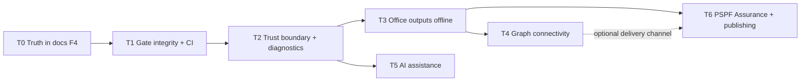

# PSPF Grand Plan

Status: **active — planning authority for product design, remediation and connected-capability programmes**
Last updated: 2026-10-10 (ADR 0103 accepted and v1.77.0 implemented; W0 drills passed and the trial held; ADR 0104 proposed for the register prototype that removes the need for the extensions; repo version 1.77.0)

## Purpose

This is the single forward plan for the PSPF ecosystem. It coordinates these workstreams:

1. **Product reframe and browser-first direction (2026-10-05)**: the active forward direction, recorded in the section below and in accepted ADRs 0101 and 0102. It pauses streams 2–4 pending mapped disposition of remaining requirements.
2. **Remediation** of the findings from the June 2026 ecosystem architecture/UX review (findings F1–F7; see `/memories` note `ecosystem-review-2026-06` and the tranche descriptions below, which are self-contained). _Paused 2026-10-05._
3. **New capability programmes**: Microsoft 365 / Graph integration, AI assistance with a mandatory kill switch, the PSPF Assurance extension, and a secure assurance-publishing step. _Paused 2026-10-05; Microsoft 365 and AI are re-scoped by ADR 0101 D4._
4. **Clean-start workbench design**: a coherent cyber risk, assurance and work-planning experience, with substantial interface and visual redesign and modular extension consolidation under consideration. _Paused 2026-10-05; its premises are carried into ADR 0102 where still applicable._

The ordering principle is deliberate: **make the documentation truthful first (F4), then close the trust boundary, then build new features on top of a boundary we trust.** New connected features (Graph, AI) must not land on an import/diagnostics layer that cannot validate or explain failures.

This plan does not override the authority chain in `pspf-spec-consistency-index.md`. Every tranche below that changes architecture, schema, or invariants **starts with an ADR**; this document records the sequence and the design constraints, not the decisions themselves.

## Product reframe and browser-first direction (2026-10-05)

Status: **accepted direction; governance archive and obsolete gate retirement completed 2026-10-05; first workbench slice implemented at v1.77.0 under accepted ADR 0103 (2026-10-10). The next slice is the register prototype in proposed ADR 0104, after which the held owner trial runs as ADR 0102 D8(iii); see [Next build phases](#next-build-phases-after-the-first-workbench-slice-2026-10-10).**

Governing records: [ADR 0101](adr/0101-product-reframe-managers-three-jobs.md) (the manager's three jobs; pause of C2–C6, O1–O3, the clean-start design phases and the website/brand brief) and [ADR 0102](adr/0102-browser-first-workbench-supersedes-extensions.md) (one browser single-page application replaces the five VS Code extensions). Both ADRs were accepted on 2026-10-05. The [decision register](docs/decision-register.md#product-reframe-and-browser-first-direction-2026-10-05) records the product-owner positions. The five extensions and dual-mode Explorer remain the shipped product until their staged retirement completes.

The owner accepted the matter-centred first-slice recommendations on 2026-10-08. The [dated ADR 0102 amendment](adr/0102-browser-first-workbench-supersedes-extensions.md#accepted-amendment-matter-centred-first-slice-2026-10-08) governs that refinement; it does not complete P1/P2 or change extension retirement conditions. [ADR 0103](adr/0103-v1-77-workbench-first-slice-matter-capture-and-recovery.md), accepted 2026-10-10, allocates v1.77.0 to the first slice, fixes the workbench-local contracts, release model, hosting, recovery and capture thresholds, and amends ADR 0102 D8(i) so that the frozen extensions advance in version only for alignment and are not republished. `packages/workbench` implements that slice; `check:workbench` and `e2e:v1.77` gate it.

### Why

The 2026-10-05 review set the shipped product beside the product owner's actual working day. The product serves a solo assurance practitioner authoring structured compliance records offline in VS Code. The owner's job is conversation-driven (meetings and email), interrupt-driven (ad hoc requests for information, briefs and reports) and team-focused (managing security professionals), across Microsoft 365, a GRC platform, a SIEM and other tooling. The repository already records that the product has not made that work easier; the organisational response had been further programmes rather than a changed design centre. Atlas, a sibling product, demonstrates the same risk–action–evidence–verification model in one single-page application at roughly a tenth of the surface.

### Direction

1. **Three jobs are the design centre**: J1 capture from conversation, J2 answer ad hoc requests fast, J3 run the team (ADR 0101 D1).
2. **One browser workbench, navigated by job**: Inbox, Ask, Work, Team, Publish; three-pane layout; place and drafts preserved across restart (ADR 0102 D2–D3).
3. **Publish-to-folder is the integration.** Artefacts written into a OneDrive-synced SharePoint folder are grounded by Microsoft 365 Copilot with no integration code — tenant-AI Rung 0. Rungs 1 (declarative agent) and 2 (Azure OpenAI in tenant) follow only with organisational approval (ADR 0101 D4, ADR 0102 D4–D5).
4. **Team sharing is a requirement.** Pub's local-only rule becomes team-visible with redaction at the team boundary (ADR 0101 D2, ADR 0102 D6).
5. **Model carried, host retired.** Contracts, reference data, ISM library, brief renderer and the master bundle carry forward; writer lock, trusted-caller policy, command API and `.pspf/` layout do not. Extensions are frozen (no features, not republished after 1.76.0; package versions advance only to satisfy alignment per the 2026-10-10 D8(i) amendment) and retired in four steps, nothing deleted before step four (ADR 0102 D7–D8).
6. **Governance diet.** Superseded specs and ADRs are archived under `docs/history/`; redaction, build, test and accessibility gates stay; surface-count budgets, journey-cost and the gate-integrity meta-gate are retired (ADR 0101 D7).

Within that direction, the first slice is a matter-centred personal workbench: one linked account supports capture, sourced answers, audience briefs and follow-through. Matters do not replace the register or grant organisational authority. Vite/Lit/IndexedDB is the selected starting stack; the precise navigation labels still need a browser walkthrough.

### Discovery sequence (replaces C2–C6 and O1–O3 while paused)

P1 evidence is recorded in the [work-friction log](docs/work-friction-log.md). FL-001 to FL-005 (2026-10-05) are qualitative accounts of triage, reporting, project guidance, team delivery and cross-team dependencies. FL-006 to FL-008 (2026-10-06) are anonymised event-level examples with an information-recovery test; the owner also reports that Copilot over existing mail makes assumptions but finds no definitive answers. The resulting [friction-led design decisions](docs/decision-register.md#friction-led-design-decisions-2026-10-06) refine ADR 0102 D2 for P2 and P3. Event-level timings, artefact ranking, deployment permission and the two-week baseline remain outstanding.

The [personal-supplement scope decisions](docs/decision-register.md#personal-supplement-first-trial-scope-2026-10-05) refine the first trial: one owner operates a non-authoritative workbench, capturing relevant updates from existing email and Teams exchanges. Confirmation is sought where useful but not required for capture; immediate success is the owner's situational awareness and source-backed account of their work at acceptable maintenance effort. Collaborative updates and team adoption are not prerequisites for this trial. Long-term team sharing, publication controls and the P1-P3 discovery and implementation sequence remain unchanged.

| Step | Work                                                                                                                                                                                                                                                                        | Exit evidence                                                                                                                                                                                                                                                                                                                                                                                                                                                                                        |
| ---- | --------------------------------------------------------------------------------------------------------------------------------------------------------------------------------------------------------------------------------------------------------------------------- | ---------------------------------------------------------------------------------------------------------------------------------------------------------------------------------------------------------------------------------------------------------------------------------------------------------------------------------------------------------------------------------------------------------------------------------------------------------------------------------------------------- |
| P0   | Record the reframe (this section, ADRs 0101/0102, decision register, course-correction plan, agent instructions). Park paused streams with reason and resumption gate.                                                                                                      | Documents merged; spec-drift, AU-English and ADR-coverage gates green. **Done 2026-10-05.**                                                                                                                                                                                                                                                                                                                                                                                                          |
| P1   | Two-week work-friction log at the owner's workplace: each request, brief or action-from-meeting with source systems, time, output shape and recipient. Run the Rung 0 trial in parallel: publish current exports to a SharePoint folder and ask Copilot.                    | A ranked list of real artefacts and sources; a note of what Copilot answered correctly from the published briefs; a note of what deployment the organisation would plausibly permit.                                                                                                                                                                                                                                                                                                                 |
| P2   | Validate the accepted thin Matter model and selected Vite/Lit/IndexedDB starting stack; complete the owner comparison, contract/reuse and publication/history/erasure design, read-only bundle refresh rules, recovery design and parser/finder proof.                      | **Closed 2026-10-10 by ADR 0103**, which fixes the contracts, refresh/erasure rules, recovery design and starting thresholds. The owner reports the comparison performed; its results are not recorded in the repository and the thresholds remain untuned starting values (see risks W-R1 and W-R2 below). Workplace prerequisites remain unverified.                                                                                                                                               |
| P3   | Capture -> matter link -> sourced answer -> reviewed brief edition -> response -> next step, with three initial profiles, read-only register context, recovery/backup and controlled Markdown publish-to-folder. ADR 0103 allocates v1.77.0 with no axis change.            | **Build done 2026-10-10** (`packages/workbench`, FL-009 synthetic acceptance test, `e2e:v1.77` green). **Trial held**: the owner ran the recovery drills on 2026-10-10 (backup, restore and related mechanics work) but cannot use the workbench for a fortnight yet; the trial runs after the register prototype as ADR 0102 D8(iii) under the [trial protocol](#w0-owner-trial-protocol-on-hold-becomes-the-d8iii-independence-cycle). ADR 0102 D8 parity and retirement conditions are unchanged. |
| P4   | Governance diet (archive and obsolete gate retirement completed 2026-10-05), followed by extension retirement steps (ii)–(iv) of ADR 0102 D8: (ii) the register prototype (proposed ADR 0104), (iii) the owner independence cycle, (iv) deprecation and `packages/legacy/`. | Marketplace listings deprecated; packages under `packages/legacy/`; history archive remains in place; retained gates listed in `pspf-acceptance-and-quality-gates.md`.                                                                                                                                                                                                                                                                                                                               |

### Matter-and-dossier design option (2026-10-08)

Status: **design direction and bounded first-slice scope accepted 2026-10-08; P2 validation and implementation entry conditions remain open**. The [decision register](docs/decision-register.md#accepted-recommendations-2026-10-08) records the owner's acceptance of all recommendations, governed by the dated ADR 0102 amendment. A VS Code companion is deferred; current extension retirement remains unchanged.

The [qualitative discovery round](docs/work-friction-log.md#qualitative-discovery-round-closure) closed on 2026-10-08, with FL-009 and FL-002 leading the owner's design priorities. This is not completion of P1: measured timings, the Rung 0 trial and deployment permission remain unverified. Design content will be synthetic; real workplace artefacts will not be shared here.

Evaluate a complete risk concern -> decision brief -> committee response -> follow-up scenario. The dossier is a projection of shared linked records, not duplicate risks, actions or evidence. Audience profiles determine useful questions and detail, not permissions or authority. An issued brief preserves the reviewed account at that occasion; later changes flag the live dossier without rewriting the submitted paper. Obstacles expose the next question, action or decision rather than only a blocked status.

The next owner comparison uses one synthetic matter across CISO, Ops and a committee profile, including a meeting that asks for more information rather than deciding. Compare information recovery and total maintenance/briefing effort with the current workflow and a simple document-and-list alternative, retaining FL-008 as the no-extra-capture comparison. Thin Matters are the adopted organising unit; Matters and Briefs as top-level navigation labels remain a candidate, not a replacement already adopted.

The accepted decisions are:

1. **Thin Matter, derived dossier:** retain concern, scope, intended outcome, personal follow-up state and references; link shared requests, advice, evidence, meetings and work without another risk/action/approval register. Capture stays selective.
2. **Three initial profiles:** CISO, Ops and one committee profile use the same facts, contradictions and unknowns. Profiles change emphasis, not permissions or authority; DIDC is the synthetic example, with real remit unverified. Defer a profile designer.
3. **Actual issued editions:** preserve reviewed text including operator edits, audience, occasion, issue date and source revisions. Corrections create a new edition; live changes flag narrative using separate review/issue baselines. Redaction and erasure still apply.
4. **Separate meanings:** personal involvement, meeting disposition and wider outcome remain distinct. Submitted does not mean approved; advice, delivery and effectiveness are not interchangeable. Unknown ownership, outcomes and delay reasons stay visible.
5. **Read-only register reference:** load a validated master-bundle export with version/date, link to its records and refresh explicitly without rewriting historical references. Start the matter/trail store empty; no register migration, editable copy or live Core bridge. Authoring remains in frozen extensions.
6. **Reuse browser foundations:** start with Vite/Lit/IndexedDB and shared packages, not the old entity-first navigation. Reopening for React/Mantine requires a demonstrated advantage; no speed comparison is claimed. Atlas remains separate.
7. **First-slice recovery:** separate persisted drafts from explicit record Save; restore selection, context and unfinished text after restart. Validate backup/restore and interrupted/failed-save behaviour. Browser-local storage is not a backup or workplace permission.
8. **Conservative parser and suggestions:** start with a small explicit format, preserve unsupported text as a note, retain provenance, prefer exact IDs before fuzzy titles and require confirmation for changes/merges. Parser/match thresholds remain to be evidenced before UI commitment.

The bounded first workflow is **capture -> link to a matter -> assemble a sourced answer -> review and issue a brief -> record the response -> recover the next step**. Include the three profiles, read-only context, recovery/backup and controlled publish-to-folder. Markdown is the initial useful format; Word, CSV and the wider artefact catalogue are deferred, not cancelled. Local Save is not publish; preview, explicit review and default-deny controls apply to every copy/export boundary.

Collaborative editing, Graph, in-app AI, a VS Code companion, broad committee tooling and Shop/Assurance expansion are deferred. Long-term team sharing and the tenant-AI approval ladder remain requirements. No paused programme is resumed.

The [P2 synthetic evaluation checkpoint](docs/p2-matter-dossier-evaluation.md) implements a reference-only probe and reproducible report for that scenario (`evaluate:p2-matter`). Its focused tests cover source-backed recovery, profile-invariant facts, preserved candidate issued editions, separate change baselines and selective capture. The owner reports the comparison performed on 2026-10-10 while ADR 0103 was drafted; the results are not recorded in the repository, so the probe remains design evidence rather than a measured saving. The checkpoint itself allocated no release; v1.77.0 was allocated afterwards by ADR 0103. All compatibility axes remain `1.17.0`.

The owner clarifies that heavy text work and information density, the original reasons for VS Code, no longer distinguish it from a capable browser application. Prove editing, dense layouts, keyboard operation and context recovery in the browser; do not retain a second interface for those reasons alone. Only a demonstrated repository/developer-tooling workflow could justify evaluating a later companion, with no second store or duplicate workbench.

The ADR 0102 amendment records acceptance of the model, starting stack, reference approach and bounded P3 design scope, not completion of P2. The entry conditions it listed were settled on 2026-10-10 by ADR 0103: field-level Matter/trail/edition/draft contracts, source refresh and erasure rules, recoverable storage, starting parser/finder thresholds, the v1.77.0 release model and the D8(i) freeze wording. Workplace baseline, Rung 0 results, deployment permission beyond the owner's trial and browser keyboard/density usability remain unverified and are carried into the next build phases below.

### Parked streams and resumption gate

C2–C6 (`docs/course-correction-plan.md`), O1–O3 (above), the six-phase clean-start design and the website/brand brief remain parked with the written reason **superseded design centre**. Resumption requires a disposition map assigning each required behaviour to a destination in the new direction or recording that it is no longer required; acceptance of ADR 0102 alone does not resume a slice. C0 and C1 remain complete; their evidence remains valid. ADR 0099's Commitment Phases 3–7 remain parked as before and are not resumed by this section.

### Open questions carried forward from P1/P2

- Hosting for the trial is settled by ADR 0103 (current static host at `/workbench/`, browser-local storage in the owner's profile). Hosting the organisation will accept for real work data beyond the trial, and for any team member other than the owner, remains open (decision W-D4).
- Whether Assurance (assessments, pentest findings) and Shop (suppliers, spend) jobs appear in the friction log; they return as Work lenses only if they do. Nine qualitative entries so far show neither.
- Atlas: products stay separate; a shared engine package is reconsidered only after the work-side model stabilises through the trial.
- Tenant AI beyond Rung 0 depends on Copilot licensing, the agency's position for the data's classification and an organisation-sanctioned development tenant. Rung 0 itself is untested: no Markdown edition has yet been published to a SharePoint-synced folder and queried through Copilot.

## Next build phases after the first workbench slice (2026-10-10)

Status: **planning. No slice beyond v1.77.0 is allocated. On 2026-10-10 the owner exercised the W0 recovery drills (backup, restore and the other mechanics work), cannot run the fortnight trial yet, and redirected the next build at removing the need for the five extensions. The next slice is the register prototype in proposed [ADR 0104](adr/0104-workbench-register-prototype-extension-independence.md); the owner trial moves after it and becomes ADR 0102 D8(iii).**

This section replaces the "first SPA slice" preparation wording used since 2026-10-05. It records what v1.77.0 actually delivered against ADR 0103, the gaps that remain, the extension parity map the owner marks, the prototype sequence, the deferred owner trial, and the risks and decisions that the next design round must settle. It allocates no code change.

### What v1.77.0 delivered against ADR 0103

| Area                 | State in `packages/workbench`                                                                                                                                                                                                                                     |
| -------------------- | ----------------------------------------------------------------------------------------------------------------------------------------------------------------------------------------------------------------------------------------------------------------- |
| Contracts            | Matter, Reference, Trail item, Profile (`ciso`, `ops`, `committee`), Edition and Draft as workbench-local types; only `id` is `public`, every other field `sensitive`; dossier derived, never stored; two change baselines (`lastReviewedAt`, latest `issuedAt`). |
| Store                | IndexedDB `pspf-workbench.v1` with `matters`, `trail`, `editions`, `drafts`, `snapshots`, `tombstones` and `meta`; single-transaction saves that leave prior records intact on failure; explicit erasure with tombstones.                                         |
| Recovery             | Draft autosave on input; route, selection, scroll and unfinished text restored on load; backup envelope with `storeVersion` 1, app version and SHA-256 checksum; restore validates before replacing; seven-day backup reminder.                                   |
| Register reference   | Validated master-bundle import held as a read-only snapshot; reference status `current`, `changed`, `missing`, `external` or `unchecked`; references never rewritten.                                                                                             |
| Capture and matching | Ten type labels with optional `Source:`/`Link:` lines; unsupported text kept verbatim as a note; copyable Copilot prompt template; exact ID, then normalised title, then Jaccard ≥ 0.6 with ≥ 2 shared tokens, at most three suggestions.                         |
| Publish              | Markdown edition via the File System Access API with a download fallback; redaction summary stored on the edition; issue is an explicit reviewed step.                                                                                                            |
| Gates and release    | `check:workbench`, `e2e:v1.77`, Marketplace refusal for the frozen extensions, `/workbench/` staged by the web release; the FL-009 synthetic acceptance test passes.                                                                                              |

Gaps against ADR 0103, recorded so the next slice does not inherit them silently:

1. **Prefix registration.** `MTR`, `TRL`, `EDN`, `DRF` and `SNP` are defined only in the workbench; ADR 0103 §3 expects registration in `@pspf/contracts`.
2. **Thresholds untuned.** The §6.3 starting values ship unchanged; the promised re-tuning against FL-009 synthetic examples has not been performed or recorded.
3. **Comparison unrecorded.** The owner reports the P2 comparison done; no results are in the repository.
4. **Provenance never `ai-draft`.** Every parsed trail item is recorded as `parsed`, so text produced by Microsoft 365 Copilot and text typed by the operator are indistinguishable in provenance.
5. **Name redaction is list-based.** Publish removes email addresses and names the operator lists for that issue; an unlisted name in free text is not caught.
6. **No workbench accessibility evidence.** `check:accessibility` covers Explorer routes only; there is no axe, layout or 200% zoom evidence for `/workbench/`.
7. **Autosave on page hide unverified.** Drafts save on input; no `pagehide` or `visibilitychange` handler is present, so §5.1's page-hide save is not evidenced.
8. **Publish folder not remembered.** The directory is chosen on every issue; ADR 0102 D4 describes a folder chosen once.
9. **No multi-tab coordination.** Two open tabs write to one database with last-write-wins; the browser host has no equivalent of the retired writer lock.

### W0: owner trial protocol (on hold; becomes the D8(iii) independence cycle)

**2026-10-10 update.** The owner performed the recovery drills in step 5 against the deployed v1.77.0 build: backup, restore and the related mechanics behaved correctly. The fortnight of real use cannot start yet and is placed on hold. It is not abandoned: once the register prototype (W1 below) is in place, the trial runs once over one tool and doubles as ADR 0102 D8(iii) "use only the SPA for a fortnight". Steps 1–4, 6 and 7 below are retained for that run with one change: register authoring happens in the workbench, not the extensions.

The trial is a human activity; agents may prepare the recording template and summarise anonymised notes but are not the operator.

1. **Duration and scope.** A fortnight of real use for capture, follow-up and ad hoc asks. Register authoring continues in the frozen extensions; the workbench reads a validated export of that register.
2. **Before starting.** Take a backup and store it in an organisation-approved location; import the current register export; the owner sets the keep/adjust/stop criterion (decision W-D11) in the decision register.
3. **Record per episode** in the [work-friction log](docs/work-friction-log.md#workbench-trial-entries-from-2026-10-10): the trigger (meeting, email, request), whether capture was attempted, which items the parser produced and how many were accepted, retyped, merged or discarded, whether a match suggestion was right, which register references were used, and the elapsed effort as the owner's estimate. Anonymised; no workplace artefacts in the repository.
4. **Seven-type recovery check.** At the end of the fortnight, for three trial matters, record lookup time and answering source for ask, proposed action, owner, decision, status, outcome and reason for delay, and compare with the P1 owner synthesis ratings. Unknowns count as unknown, not as misses.
5. **Recovery drills.** Once during the trial: close the tab mid-capture and confirm the draft returns; restore from backup into a second browser profile and confirm counts match; erase one synthetic matter and confirm the tombstone shows in references.
6. **Rung 0 in parallel.** Publish at least three issued editions into the OneDrive-synced SharePoint folder and ask Copilot the seven recovery questions about them; note which answers are correct, which are inferred and which are missing.
7. **Exit evidence.** A trial summary in the friction log, the seven-type comparison, the Rung 0 note, a defect and friction list, and the owner's keep/adjust/stop judgement against the document-and-list alternative. The judgement decides whether retirement step (iv) proceeds, the design changes, or the direction is reconsidered.

### Extension parity map

The prototype ports what the owner uses, not the Workshop command surface. The owner marks the **Used** column before ADR 0104 is accepted; anything left unmarked is archived with its data exported, not ported. The inventory below is drawn from the Core command set, the Workshop essentials list, Explorer's local authoring and the Shop/Pub/Assurance stores. The master bundle is publication-sanitised, so **the SQLite database is the only complete copy of the register**; that fact drives the migration decision (W-D14).

| Job today                                                                                   | Where it lives                             | Prototype disposition                                                                | Used (owner) |
| ------------------------------------------------------------------------------------------- | ------------------------------------------ | ------------------------------------------------------------------------------------ | ------------ |
| Initialise workspace, sample data, writer lock, trusted callers, Git settings               | Core                                       | Not carried; store starts by migration import                                        | n/a          |
| Requirement record edit; compliance assessment (state, basis, acceptance definition, notes) | Workshop, Explorer compliance editor       | **Minimum set**                                                                      |              |
| Evidence create, attach, link, freshness review                                             | Workshop, Evidence Review Queue            | **Minimum set**                                                                      |              |
| Action create/edit, owner team, planning state, blocker class, due-date history             | Workshop, Plan of Action; Explorer actions | **Minimum set**                                                                      |              |
| Risk create/edit, assessment, treatments and controls, escalation history                   | Workshop Risk workbench; Explorer risks    | **Minimum set** (record and links); matrix, bow-tie and coverage views owner-confirm |              |
| Typed links between requirement, evidence, action, risk                                     | Core link rules                            | **Minimum set**                                                                      |              |
| Snapshot; Close reporting period; snapshot anchors                                          | Core, Reporting Workbench                  | **Minimum set**                                                                      |              |
| Posture brief; Executive Brief; Domain packs; Team report card                              | Explorer posture; Reporting Workbench      | **Minimum set** via `@pspf/brief-renderer`                                           |              |
| Export master bundle; import bundle; Explorer round-trip                                    | Core, Explorer Core exchange               | **Minimum set**                                                                      |              |
| Integrity scan; dataset diagnostics; validate workspace                                     | Core                                       | **Minimum set**, folded into Save and Export preflight                               |              |
| Directions register and responses                                                           | Workshop                                   | Owner-confirm                                                                        |              |
| Strategy and strategic choices; CISO Master Plan; Digital CISO Magazine                     | Workshop                                   | Owner-confirm                                                                        |              |
| Narratives: edit, use generated, restore previous, operator notes                           | Reporting Workbench                        | Owner-confirm                                                                        |              |
| ISM control mapping; ISM review workbench; batch mapping sweep                              | Workshop                                   | Owner-confirm (`@pspf/ism-source-library` is browser-pure)                           |              |
| Change records; tags; saved views; work log                                                 | Workshop, Explorer                         | Owner-confirm                                                                        |              |
| Crosswalk import from risk sources (fixture/live)                                           | Workshop, Core `commitRiskCrosswalk`       | Owner-confirm; live source integration stays out                                     |              |
| Suggested actions, capture sweeps                                                           | Reporting Workbench, Evidence Review Queue | Owner-confirm                                                                        |              |
| Pentest workbench; Assurance City                                                           | Assurance (reads Core)                     | Archive unless marked                                                                |              |
| Suppliers, contracts, spend items, forecast                                                 | Shop (`.pspf/shop/shop.json`)              | Archive JSON to approved backup location unless marked                               |              |
| People, roles, teams, assignments, workforce cockpit                                        | Pub (`.pspf/pub/pub.json`, store `1.3.0`)  | Archive JSON; people return as roles only; team sharing per ADR 0102 D6 later        |              |
| Team share bundle                                                                           | Core `exportTeamShareBundle`               | Later slice, after W-D4 hosting decision                                             |              |

### Prototype sequence

One active slice at a time; each needs an accepted ADR, declares `publication` for every new field, keeps the compatibility axes unchanged, and leaves the frozen extensions untouched beyond alignment bumps. Versions are indicative.

| #   | Indicative version | Focus                                             | Entry                                                                 | Done when                                                                                                                                                                                                                                                                                                                                    |
| --- | ------------------ | ------------------------------------------------- | --------------------------------------------------------------------- | -------------------------------------------------------------------------------------------------------------------------------------------------------------------------------------------------------------------------------------------------------------------------------------------------------------------------------------------- |
| W1  | 1.78.0             | Register prototype: extension independence        | ADR 0104 accepted; parity map marked; W-D7, W-D8, W-D13–W-D19 decided | ADR 0104 §6: synthetic extension-independence test passes end to end; fixture migration is field-exact including `sensitive` fields; Core and Explorer import a workbench export; workbench backup restores the register; `check:register-migration`, workbench accessibility gate and `e2e:v1.78` green. Delivered in the increments below. |
| W1a |                    | Store, rules and migration policy                 | —                                                                     | `entities`, `links`, `changeLog` stores at database version 2; backup `storeVersion` 2 with upgrade-on-restore; pure write rules extracted into `@pspf/contracts` with their existing tests; Web Lock single writer; prefixes registered (closes gaps 1 and 9).                                                                              |
| W1b |                    | Lossless migration in                             | W1a                                                                   | `scripts/migrate-core-register.mjs` reads the SQLite file via sql.js and emits the checksummed register import file; workbench imports it idempotently; fixture fidelity test exact.                                                                                                                                                         |
| W1c |                    | Author the spine                                  | W1a                                                                   | Requirement assessment, evidence, action (with due-date history), risk and typed links editable with explicit Save, drafts and change log; matter references resolve against the live store.                                                                                                                                                 |
| W1d |                    | Snapshot, brief and reporting pack                | W1c                                                                   | Snapshot with per-record status map; Close reporting period; posture brief and reporting pack generated and issued through the existing edition and publish path.                                                                                                                                                                            |
| W1e |                    | Export and round-trip                             | W1b, W1d                                                              | Publication-sanitised master bundle export with manifest and checksums; Core and Explorer import it; export preflight blocks unsupported Risk states; `check:personal-data` fixtures cover workbench output.                                                                                                                                 |
| W1f |                    | Owner-confirm items and truth-up                  | Parity map marked                                                     | Each marked owner-confirm row ported or explicitly deferred; gaps 2, 4, 6, 7 and 8 closed or re-deferred; owner walkthrough at keyboard and 200% recorded.                                                                                                                                                                                   |
| W2  | —                  | Owner independence cycle (D8(iii); the held W0)   | W1; cutover date and W-D11 recorded; W-D4 position for the owner      | Owner migrates the real register and runs one reporting cycle and a fortnight of capture and asks in the workbench only; W0 steps 1–4, 6 and 7 recorded in the friction log; keep/adjust/stop judgement made.                                                                                                                                |
| W3  | 1.79.0             | Retirement step (iv) and hardening                | W2 keep                                                               | Marketplace listings deprecated with a pointer; extension packages moved under `packages/legacy/`; Explorer local-authoring routes retired; trial defects fixed; threshold tuning evidence committed (W-D10); nothing deleted that the owner has not exported.                                                                               |
| W4+ | 1.80.0+            | Sourced answers; follow-through worklist; sharing | W3; friction-log evidence                                             | The former W2/W3 candidates (answer cards over the live register; worklist by follow-up state and waiting-on role; FL-001/FL-002 synthetic tests) and the first team-sharing design under ADR 0102 D6 and W-D4.                                                                                                                              |

Team, Graph, in-app AI (Rung 1 and 2), Word/CSV output, Assurance and Shop lenses and any VS Code companion stay deferred. They return only with friction-log evidence and the approvals ADR 0101 D4 and ADR 0102 D6 require.

### Risks surfaced by the first slice

Qualitative ratings are the author's; the owner may re-rate them at the W0 review.

| ID    | Risk                                                                                                                                                                                                        | Rating           | Mitigation and owning decision                                                                                                                                            |
| ----- | ----------------------------------------------------------------------------------------------------------------------------------------------------------------------------------------------------------- | ---------------- | ------------------------------------------------------------------------------------------------------------------------------------------------------------------------- |
| W-R1  | The design is validated by owner assent only: the P2 comparison results are unrecorded and the P1 measured baseline was never taken, so the trial can compare only against the qualitative owner synthesis. | Likely, medium   | Record the comparison outcome in the P2 evaluation document before the W1 ADR; label the trial comparison as qualitative.                                                 |
| W-R2  | Untuned matching produces noisy or absent suggestions and the owner stops trusting the link step.                                                                                                           | Likely, medium   | Count accepted versus rejected suggestions during W0; tune in W1 against a committed synthetic corpus (W-D10).                                                            |
| W-R3  | Browser storage is cleared by policy, profile reset or eviction under storage pressure, losing trial data.                                                                                                  | Possible, high   | Seven-day reminder exists; request persistent storage and show its result (W-D2); backup before browser or policy updates.                                                |
| W-R4  | The backup file is plaintext sensitive data on disk or in a synced folder.                                                                                                                                  | Possible, high   | Store backups only in an organisation-approved location; decide on passphrase encryption (W-D3). Any encryption is symmetric; no classical asymmetric primitive is added. |
| W-R5  | A person's name in free text reaches a published Markdown edition because it was not in the operator's redaction list.                                                                                      | Possible, high   | Preview remains mandatory; move to structured role fields with optional in-boundary names (W-D6); extend `check:personal-data` fixtures to workbench output.              |
| W-R6  | Two tabs or a tab plus a restored session overwrite each other's records.                                                                                                                                   | Possible, medium | Single active writer via the Web Locks API with a read-only banner elsewhere (W-D7).                                                                                      |
| W-R7  | A personally hosted static application handling work data in a managed browser is treated as organisationally approved because the owner accepted it for the trial.                                         | Possible, high   | Data stays browser-local with no telemetry or network calls; no colleague uses the trial build; hosting beyond the trial is an explicit organisational decision (W-D4).   |
| W-R8  | AI-produced text is recorded as `parsed`, contradicting the ADR 0077 provenance rule carried forward by ADR 0101 D4.                                                                                        | Certain, low     | Capture-level "pasted from Copilot" control sets `ai-draft` provenance (W-D1).                                                                                            |
| W-R9  | Accessibility and density regressions on `/workbench/` go unobserved because no gate covers it.                                                                                                             | Likely, medium   | Workbench accessibility gate in W1; owner keyboard and 200% walkthrough during W0.                                                                                        |
| W-R10 | The first field change after the trial has no migration path for database version 1 or backup `storeVersion` 1, and a restore silently downgrades or drops data.                                            | Certain, medium  | Forward-only migration policy with upgrade-on-restore and refusal of newer backups (W-D8) before any field change.                                                        |
| W-R11 | Workbench record types drift from `@pspf/contracts` conventions, making later promotion into the master bundle or team sharing costly.                                                                      | Possible, medium | Register prefixes now (W-D9); reuse the contracts `publication` declaration shape; decide promotion at W4.                                                                |
| W-R12 | Explorer and the workbench share one origin and overlapping jobs, doubling maintenance and confusing the operator about where to author.                                                                    | Likely, medium   | Explorer's fate is decided in the W4 ADR (W-D5); until then the workbench says plainly that authoring happens elsewhere.                                                  |
| W-R13 | The register snapshot goes stale while the owner authors in the extensions; references are flagged only after an explicit re-import.                                                                        | Likely, low      | Show snapshot age on every reference; consider a re-import reminder in W1.                                                                                                |
| W-R14 | The Rung 0 hypothesis fails: Copilot does not ground usefully on published editions, removing the stated reason for Markdown publish-to-folder.                                                             | Possible, high   | Test it in W0 step 6; if it fails, publish-to-folder remains a sharing mechanism and the tenant-AI ladder is re-planned, not abandoned silently.                          |
| W-R15 | The trial itself has no agreed stop rule, so a weak result is rationalised as "keep".                                                                                                                       | Possible, medium | Owner sets W-D11 before the trial begins.                                                                                                                                 |

Risks added for the register prototype (ADR 0104):

| ID    | Risk                                                                                                                                                                                                           | Rating           | Mitigation and owning decision                                                                                                                                        |
| ----- | -------------------------------------------------------------------------------------------------------------------------------------------------------------------------------------------------------------- | ---------------- | --------------------------------------------------------------------------------------------------------------------------------------------------------------------- |
| W-R16 | **Migration fidelity.** The master bundle is publication-sanitised, so migrating through it silently drops every `sensitive` field (owner teams, due-date history, acceptance definitions, narratives, notes). | Certain, high    | Migrate from the SQLite file with a repository script and prove field-exact fidelity on a fixture before the owner's register is touched (W-D14; ADR 0104 §4).        |
| W-R17 | **Scope creep to Workshop parity.** 47 of 72 Workshop commands are specialist; porting by default would reproduce the surface the reframe retired.                                                             | Likely, high     | The owner-marked parity map is the only widening mechanism (W-D15); unmarked rows are archived with data exported.                                                    |
| W-R18 | **Two authoring stores during transition.** Edits continue in the extensions after migration and diverge from the browser store.                                                                               | Likely, medium   | Cutover date recorded (W-D18); idempotent re-migration by `id` and `updatedAt`; the workbench shows the migration date on its home.                                   |
| W-R19 | **Rule drift.** Core's write rules are re-implemented in the browser from memory and differ in edge cases (narrative chains, link pairs, due-date seeding, Risk export preflight).                             | Possible, high   | Extract the rules into `@pspf/contracts` with their existing tests and have both Core and the workbench call the same functions (W-D16); Core is otherwise untouched. |
| W-R20 | **Unlisted but used workflows.** A Reporting Workbench or Risk workbench feature the owner relies on is not in the minimum set and is discovered missing mid-cycle.                                            | Possible, medium | Parity map marked before ADR 0104 acceptance; W1f ports marked rows; the extensions stay installed and readable until step (iv).                                      |
| W-R21 | **Browser store performance.** A full register (hundreds of risks, thousands of links and change-log rows) slows the worklist, dossier or export in IndexedDB.                                                 | Possible, medium | Measure W1c and W1e against the existing 504-risk fixture and the repository performance profile; index by `entityType`, `updatedAt`, `fromId`, `toId`.               |
| W-R22 | **Loss of Git history.** Leaving `.pspf/` removes the diffable record of register changes that Git provided.                                                                                                   | Certain, low     | Append-only `changeLog`, snapshots and dated backups replace it; the restore screen states what history is and is not present.                                        |
| W-R23 | **Shop and Pub data stranded.** Commercial notes and workforce records in the JSON stores are forgotten when the extensions are set aside.                                                                     | Possible, medium | Export both stores to the approved backup location before cutover (W-D19); record the export in the decision register.                                                |
| W-R24 | **Independence proven on fixtures only.** The synthetic test passes but the real register exposes shapes (legacy actions without seeded history, custom risk assessment states) the fixture lacks.             | Likely, medium   | Migration script reports every envelope or rule violation per record before writing; owner reviews the report; nothing is coerced silently.                           |

### Decisions required before or during W1

Recorded here as proposals; the [decision register](docs/decision-register.md#decisions-required-for-the-next-build-phases-2026-10-10) records the owner's positions when taken. W-D5 and W-D11 are re-timed by the 2026-10-10 redirection.

| ID    | Decision                               | Options                                                                                                                                      | Recommended position                                                                                                                          | Needed by                  |
| ----- | -------------------------------------- | -------------------------------------------------------------------------------------------------------------------------------------------- | --------------------------------------------------------------------------------------------------------------------------------------------- | -------------------------- |
| W-D1  | AI provenance at capture               | Infer from text; operator control per paste; always `parsed`                                                                                 | Operator control per paste setting `ai-draft`; never inferred                                                                                 | W1                         |
| W-D2  | Persistent storage request             | Do nothing; call `navigator.storage.persist()` and show the result                                                                           | Request and show the result; remind if denied                                                                                                 | W1                         |
| W-D3  | Backup encryption                      | None plus approved location; passphrase-derived symmetric encryption of the envelope                                                         | Defer until W0 shows where backups actually go; if added, AES-256-GCM with a memory-hard KDF, no classical asymmetric primitive               | W1 ADR                     |
| W-D4  | Hosting beyond the owner's trial       | Current static host; organisation static host; SharePoint page; Teams tab                                                                    | Decide with the organisation after W0; no colleague use before then                                                                           | Before any sharing         |
| W-D5  | Explorer's future                      | (a) keep both; (b) fold local authoring into the workbench, Explorer becomes publication review only; (c) retire Explorer into the workbench | (b), decided with ADR 0104: the workbench is the only authoring surface; Explorer local-authoring routes retire at step (iv)                  | ADR 0104                   |
| W-D6  | People in trail text                   | Free text plus list-based redaction; structured role and optional name fields with default-deny                                              | Structured role field, optional name held inside the team boundary and never emitted (ADR 0103 §3 rule 3)                                     | W1 or W3                   |
| W-D7  | Multi-tab policy                       | Last write wins; single active writer via Web Locks; per-record conflict detection                                                           | Single active writer with a visible read-only state in other tabs                                                                             | W1                         |
| W-D8  | Store migration policy                 | Ad hoc; forward-only upgrades with upgrade-on-restore; export-and-reimport                                                                   | Forward-only; restore upgrades older `storeVersion`, refuses newer; never silent downgrade                                                    | Before any field change    |
| W-D9  | Prefix registration                    | Keep workbench-local; register in `@pspf/contracts` as non-bundle types                                                                      | Register now so IDs cannot collide with future canonical prefixes                                                                             | W1                         |
| W-D10 | Threshold tuning evidence              | Tune by feel during the trial; committed synthetic corpus with expected matches and a test                                                   | Committed corpus and test; thresholds recorded in the ADR 0103 addendum                                                                       | W1                         |
| W-D11 | Trial keep/adjust/stop criterion       | None; owner judgement; seven-type recovery improvement plus acceptable maintenance effort                                                    | Owner states the criterion before the W2 independence cycle starts; no numeric threshold is invented                                          | Before W2                  |
| W-D12 | Navigation labels for the second slice | Current Capture / Matters / Brief; ADR 0102 Inbox / Ask / Work / Team / Publish; hybrid                                                      | Decide from the W1 walkthrough once the register is in the workbench, not before                                                              | W1f                        |
| W-D13 | Register store shape                   | One object store per collection; single `entities` store with indexes plus `links` and `changeLog`                                           | Single `entities` store keyed by `id` with `entityType`, `updatedAt`, `domainId` indexes; `links` by `fromId`/`toId`; append-only `changeLog` | ADR 0104                   |
| W-D14 | Migration source                       | Publication master bundle; Core backup JSON (same thing); SQLite file read by a repository script; sql.js in the browser over the `.db` file | Repository script over the SQLite file emitting a checksummed register import file; never the publication bundle                              | ADR 0104                   |
| W-D15 | Parity set                             | Full Workshop parity; minimum spine set plus owner-marked rows; minimum set only                                                             | Minimum set plus owner-marked rows from the parity map; unmarked rows archived with data exported                                             | Before ADR 0104 acceptance |
| W-D16 | Where write rules live                 | Re-implement in the workbench; port `service.ts` wholesale; extract pure rules into `@pspf/contracts`                                        | Extract into `@pspf/contracts` with existing tests; Core keeps calling them; no `service.ts` port                                             | W1a                        |
| W-D17 | Explorer during the prototype          | Hide local authoring now; leave as is until step (iv); add a banner                                                                          | Leave functional with a banner stating the workbench is the authoring surface; retire routes at step (iv)                                     | W1e                        |
| W-D18 | Cutover rule                           | None; soft (re-migrate when needed); hard date after which the extensions are read-only by discipline                                        | Hard cutover date recorded in the decision register; idempotent re-migration if breached                                                      | Before W2                  |
| W-D19 | Shop, Pub and Assurance data           | Migrate into the workbench; archive JSON stores to the approved backup location; discard                                                     | Archive; people return as roles only; commercial data returns only with friction-log evidence                                                 | Before cutover             |

### Rules for the next phases

- One active slice; an accepted ADR precedes code; versions are indicative until the slice ADR allocates them.
- The frozen extensions receive no features and are not republished; versions advance only for alignment. Repository scripts that read `.pspf/` for migration are tooling, not extension features.
- Nothing is deleted before ADR 0102 D8(iv), and nothing at step (iv) that the owner has not exported.
- No paused programme resumes without the disposition map ADR 0101 D5 requires.
- Every new field declares `publication`; the default is `sensitive`; nothing leaves the team boundary without preview and redaction. The lossless register import and backup files never leave the owner's device or approved backup location.
- Use Opus for slice ADRs, publication and storage boundaries, migration policy, rule extraction and every keep/adjust/stop judgement; Sonnet for gated implementation once the contract is fixed; `PSPF Reviewer` reviews diffs it did not write.

## Clean-Start Workbench Design (2026-09-26)

Status: **paused 2026-10-05 — superseded design centre; see ADR 0101 D5. Premises 1, 2, 3 and 6 carry into ADR 0102; premise 4 (one modular VS Code extension) is rejected by ADR 0102; premise 5 is decided by ADR 0102 in favour of the browser.**

The product owner reports that capture, updating and reporting are all draining, and that losing working context causes cognitive shock. The [decision register](docs/decision-register.md) records the agreed design remit. The [design specification](pspf-design-spec.md#clean-start-workbench-design-brief) owns the experience; the [detailed plan](docs/course-correction-plan.md#clean-start-workbench-design-plan) owns the design phases and proposed pilot.

### Agreed Design Premises

1. **Design the whole journey.** Reconsider navigation, layout, visual hierarchy, density, controls and transitions together. Contextual capture, preserving place, meaningful progress, useful mitigation guidance and reporting reuse are one experience, not unrelated dashboards.
2. **Preserve working memory.** Recover workspace-local drafts after closing or restarting, with explicit Save for authoritative records. Keep filters, selection, scroll, focus and return paths stable. Draft persistence is not record autosave, plan admission, risk acceptance or publication.
3. **Use a fresh baseline.** There are no active users. Legacy retention, migration, old-install coexistence and preference/command compatibility are not required design deliverables. This is not permission to delete current data or to weaken future atomicity, privacy, history or recovery.
4. **Evaluate one modular extension.** One coherent workbench, potentially delivered as one installed VS Code extension including Shop, Assurance and organisational functions, is the preferred candidate. Retain useful internal module boundaries and engines; do not concatenate five interfaces or rewrite every engine. Packaging and activation need an accepted ADR before implementation.
5. **Reconsider desktop/browser responsibilities.** Do not assume the desktop must be complex or the browser permanently limited. Explorer currently supports publication review and local authoring. Define future jobs and data boundaries explicitly; no live Core bridge, capability retirement or new publication is approved here.
6. **Prove usefulness honestly.** Compare workbench-first and outcome-first concepts using the same representative jobs, including interruption and failure. Begin with product-owner walkthroughs; there is no active-user cohort and simulated checks are not user validation.

### Relationship To Existing Work

Design work can proceed now. C1/C2 remain the current implementation prerequisites; C3-C6 and O1-O3 remain the recorded implementation sequence until an explicitly accepted replacement maps their required behaviours to the selected design. Do not silently mark those slices complete or bypass security work.

The design decision point must identify what is reused, repaired, replaced or no longer required. Legacy-migration effort is excluded from the proposed fresh baseline; obsolete UI or commitment work need not be carried merely to support compatibility. Current recovery and compatibility gates still apply to the current product until their governing contracts are explicitly superseded. No version, schema, release gate or shipping date is allocated by this design update.

The target still separates **delivery -> observed effect -> reviewed risk -> business consequence**. The existing treatment-link, planning-intent and measurement gaps below remain open. A coherent interface must not hide them behind more confident wording.

### Website, Brand And Community Extension

The product owner has also opened redesign of the ecosystem website and public product story. The [website decisions](docs/decision-register.md#website-brand-and-community-design-2026-09-26), [design brief](pspf-design-spec.md#website-brand-and-community-design-brief) and [web design sequence](docs/course-correction-plan.md#website-brand-and-community-design-work) record this as part of the current design exercise, not another implementation programme.

Atlas remains a related but separate product and repository at `https://home.tobyharvey.online`; it is not a module or parent application. Explorer remains useful and should be retained as a clear hands-on entry point. Its browser-local authoring and publication boundaries do not change merely because the website or extension packaging changes.

Compare a product home with a product-and-practice home: clear purpose, a safe synthetic Explorer example, practical guides, transparent progress and an operated feedback/contribution route. Recommend one product identity across website, Explorer, workbench, docs and public outputs, with task-appropriate layouts and theme/accessibility behaviour. Atlas retains its own identity. A distinctive product name is an option to evaluate, not an agreed rename.

Start community design with useful content and maintainable participation, not a forum or account platform. Repository visibility, feedback venue, private security reporting, moderation, attribution and sample-data isolation need explicit decisions. No accounts, uploads, analytics, public community service, domain change or Atlas integration is authorised. This follow-up updates planning docs only; the ecosystem page and application remain unchanged. Implementation, publication and deployment need separate approval and any applicable existing prerequisites.

## Risk-to-Outcome Roadmap (2026-09-25)

Status: **O1–O3 paused 2026-10-05 — superseded design centre; see ADR 0101 D5. Findings POA-01 to POA-06 remain open and are re-tested against J1–J3 in ADR 0102.**

The operator has clarified the primary purpose: protect the enterprise from cyber and digital risks by connecting every planned Action to a known risk or issue, a measurable expected effect, and a strategic business outcome. The [Plan specification review](pspf-plan-spec.md#2026-09-25-product-review) records findings POA-01 to POA-06, current-source reproductions, a proposed daily operating loop and acceptance criteria. It is the stakeholder basis for this update, not evidence that the capabilities are delivered.

The product direction is **business outcome -> risk or known issue -> treatment Action -> observed result -> reviewed risk position -> business consequence**. Compliance, control libraries, delivery progress and reporting support that chain. A severity-based Action Impact weight is not measured risk reduction; completing work is not verifying effectiveness; a manually improving trend is not proof of business benefit.

### Scheduling Decisions

1. **Keep C1/C2 first.** Close Risk verification and complete the unfinished commitment persistence boundary. This review does not authorise implementation, release sequencing or a new parallel programme.
2. **C1 consumes the concrete treatment-link defect.** `treated-by` is authored by the Risk workbench but ignored by Action Impact's older `addressed-by` reader (POA-01). Verify the path through Risk, Plan, strategy and reporting, cover supported legacy cases without duplicate benefits, and record actual repair/test evidence before claiming the chain works. This is an existing-behaviour defect, not a measurement-schema expansion.
3. **C3 reduces effort without inventing plan intent.** Preserve triage/candidate/deferred/excluded work, distinguish it from agreed delivery, and expose unscheduled or estimated dates honestly (POA-04). Consolidate routine capture/update into existing surfaces using current fields (POA-05); do not add a new dashboard or remove data to meet surface counts.
4. **C4 makes treatment patterns useful for risk decisions.** Include the treatment mechanism, applicability, expected observable effect and a suggested verification method as guidance. Reuse existing Actions; accepting a template must not imply a confirmed issue, verified effect or automatic reduction in risk. Structured observations remain O2.
5. **C5 explains business consequence honestly with current data.** The promised analyst and CISO tabs should distinguish delivery, reported trends, assessment change, evidence and remaining exposure by existing strategy outcome. Missing links or observations are stated as gaps, not filled by generated claims (POA-03/06). C5 does not pretend to deliver the later measurement contract.
6. **C6 closes course correction and selects the next bounded work.** Retaining the working-context switch does not automatically resume Commitment Phases 3-7. Those phases stay parked until their specific unmet need and incremental value over the outcome loop are demonstrated. This supersedes the earlier automatic-resumption wording, not ADR 0099's accepted contracts.
7. **O1-O3 are the next capability priority after C6**, ahead of further presentation modes, a standalone PSPF Plan, Mission Control, or connected-feature expansion. The governing ADR and migration/publication decisions are prerequisites; one vertical slice at a time. Existing security hardening prerequisites continue to apply.

### Next Bounded Programme

No product versions or new compatibility-axis values are allocated by this review. C0-C6 version labels remain indicative; O1-O3 start only after the C6 close-out and their own accepted design decisions. Reuse existing contracts and revise ADR 0099 only where reuse of its parked assessment/source concepts is actually justified.

| Slice                                        | Operator result and scope                                                                                                                                                                                                          | Dependencies and completion evidence                                                                                                                                                                                                                                                       |
| -------------------------------------------- | ---------------------------------------------------------------------------------------------------------------------------------------------------------------------------------------------------------------------------------- | ------------------------------------------------------------------------------------------------------------------------------------------------------------------------------------------------------------------------------------------------------------------------------------------ |
| O1: justified work with low-friction capture | From an existing risk/confirmed issue, create or reuse one Action in context, inherit an explicit outcome path and record expected effect. Incomplete intake remains visible as triage; only justified work enters the agreed Plan | C1-C6 closed; ADR defines stable issue origin, admission policy, many-to-many references and legacy repair without a duplicate register. Core/import validation plus a live RO-J1 journey prove atomic save, no self-justification, no fabricated links/dates and no loss of existing work |
| O2: evidence-backed treatment effect         | Reuse strategy measures and risk assessment/history; add only the missing dated observations, contribution and review semantics. Completing an Action starts verification, never an automatic risk decrease                        | O1; field-level policy and compatibility/migration decisions. RO-J2 covers unknown baseline, stale/failed evidence, changed methodology, one Action treating two risks and several Actions sharing one result. Independent risk review, history preservation and cold restore demonstrated |
| O3: business-outcome Plan and brief          | In the existing Plan/Reporting surfaces, explain what was delivered, observed, reassessed, still exposed and awaiting decision for each strategic outcome; generate once from accepted facts                                       | O2; RO-J3 and one live reporting-cycle pilot show no manual re-entry and correct recognition of limitations. Risk/appetite, delivery, expected/realised benefit and forecast costs stay separate. Approved Workshop-local copy-outs only; no new Explorer publication                      |

Completion is measured by the [proposed acceptance and adoption criteria](pspf-plan-spec.md#proposed-acceptance-and-adoption-measures), not just a gate count. RO-J1 to RO-J3 are proposed additional jobs, not new implemented gates or replacements for C0's frozen FJ1-FJ4 baselines. Record interaction cost, repeated input, unresolved justification, overdue verification and whether a human can explain the evidence and limitation. Simulated checks cannot close the human walkthrough or pilot.

## Course correction programme (v1.76.0–v1.82.0)

Status: **C0 and C1 complete; C2–C6 paused 2026-10-05 with reason "superseded design centre" and resumption requires a disposition map after accepted ADR 0102 (ADR 0101 D5). Scheduling precedence passes to the reframe section above.**

Detailed slices, testing layers, and execution guidance: [docs/course-correction-plan.md](docs/course-correction-plan.md).

The 2026-09-25 risk-to-outcome review above refines C1/C3/C4/C5 acceptance and C6's next-programme decision. It does not mark any of those slices complete.

### Why

The 2026-09-20 plan review compared this document against the shipped state at v1.75.0. The ecosystem is structurally sound and the v1.62–v1.74 work was effective and traceable to recorded stakeholder feedback. But the review could not demonstrate from the repository that recent work improved the operator's experience, and it found the plan drifting away from the evidence chain that made E1–E8 and R1–R4 good.

| ID  | Finding                                                                                                                                                                                                                                                 |
| --- | ------------------------------------------------------------------------------------------------------------------------------------------------------------------------------------------------------------------------------------------------------- |
| V1  | **Verification debt is structural.** Risk Phase 4B and Commitment Phases 3–7 are both open; neither programme has had a live operator walkthrough. The pattern is to ship contract plus gate and defer the phase that asks whether a person benefits.   |
| V2  | **No outcome instrument exists.** Gates prove structure, determinism, redaction, and accessibility rule compliance. None measures whether an operator reaches a defensible answer with less effort.                                                     |
| V3  | **The surface freeze preserved the surface.** E6/E7 retired three routes and three panels (~7%); R1 re-based the budget upward. 47 of 72 Workshop commands are specialist and remain in the palette.                                                    |
| V4  | **The active programme has weak feedback traceability.** The commitment/baseline/source-binding model improves the ontology; no line of it traces to a recorded stakeholder request.                                                                    |
| V5  | **A retired affordance is returning without retesting the evidence that retired it.** ADR 0096 D1 retired presentation lenses as "itself a superfluous control"; ADR 0099 D5 supersedes that one programme later with the same user-visible affordance. |
| V6  | **The highest-traceability unshipped requests are still deferred** — the standard mitigation library, the analyst change-review screen, and the CISO accountability view. The latter two were the stated replacement for the retired lenses.            |
| V7  | **Work in progress exceeds the plan's own rule.** "One active vertical slice at a time" holds inside a programme, but two programmes are open and mutually blocking; roughly 52 items sit deferred, about two-thirds user-facing.                       |

### Decisions now in force (2026-09-20)

1. **Precedence.** This programme supersedes the 2026-09-19 decision that gave the Commitment-led programme precedence. Risk Phase 4B is no longer deferred; it is slice C1.
2. **Debt before value.** C1 and C2 close verification debt. No new capability slice starts until both are recorded complete or explicitly parked with a reason.
3. **The instrument ships first.** C0 delivers a deterministic, offline substitute for the never-run think-aloud sessions, so every later UX claim carries a recorded before-and-after number. It is labelled a substitute for observed users, never as validation.
4. **Historical C0 journey-cost instrument.** The simulated baseline remains evidence only; its release ratchet was retired on 2026-10-05 under ADR 0101 D7.
5. **Surface-count budgets are retired.** ADR 0101 D7 removes the count ratchet; the legacy route/command guard remains only to prevent named retirements from returning during transition.
6. **The lens-retirement bargain is honoured before the working-context switch is extended.** C5 ships the two promised review screens; C6 then decides the switch on evidence.
7. **What works is protected.** Deterministic narrative with printed rules, counts and denominators over scores, default-deny publication, person-free accountability, and honest degradation are constraints on every slice, not subjects of it.

### Slices

Versions were indicative when written and are now void: C1 closed on 2026-10-05 as an evidence pack on the 1.76.0 baseline without a dedicated release, and v1.77.0 was allocated by ADR 0103 to the browser workbench first slice. C2–C6 are paused and hold no version. One active slice at a time.

| #   | Version | Focus                                         | Problem | Done when                                                                                                                                                                                                                                                                                                                 |
| --- | ------- | --------------------------------------------- | ------- | ------------------------------------------------------------------------------------------------------------------------------------------------------------------------------------------------------------------------------------------------------------------------------------------------------------------------- |
| C0  | 1.76.0  | The evidence instrument                       | V2      | Implemented with accepted ADR 0100: four flagship jobs (FJ1-FJ4) carry simulated baseline interaction-cost records, cognitive-walkthrough verdicts and readability scores; the journey-cost ratchet was retired under accepted ADR 0101 D7; the records remain historical evidence. This is not observed-user validation. |
| C1  | 1.77.0  | Close Risk overhaul Phase 4B                  | V1, V7  | Live operator walkthrough, 320/768/1440 px and 200% pass, and fresh redaction/compatibility/lossless-recovery evidence for the `1.17.0` slice recorded with actual results; every disclosed limitation closed or explicitly re-deferred; `release:readiness` green on a fresh run                                         |
| C2  | 1.78.0  | Commitment programme decision point           | V1, V4  | Phase 2 completed to its exit gate including cold restore; Phases 3–7 parked with a written reason and a named resumption gate; each parked phase states its stakeholder need or admits it has none                                                                                                                       |
| C3  | 1.79.0  | Reduction as a target                         | V3      | Workshop 72→62 commands and 30→26 panels, Explorer 24→20 routes, every retired view's capability given a recorded destination; the planned declining surface schedule was retired under ADR 0101 D7; at least one flagship job improves                                                                                   |
| C4  | 1.80.0  | Standard mitigation library                   | V6      | Curated ISM-aligned, attributed, publication-declared mitigation patterns with deterministic printed selection rules and `1.18.0` provenance fields, wired into existing surfaces only; FJ2 improves                                                                                                                      |
| C5  | 1.81.0  | Analyst change review and CISO accountability | V5, V6  | Both ship as tabs inside the existing Reporting Workbench with no new command or panel; every verdict prints its rule; FJ3 and FJ4 were to be compared with historical C0 evidence; the journey-cost ratchet is retired                                                                                                   |
| C6  | 1.82.0  | Working-context decision and close-out        | V5, V7  | The Operations ↔ Oversight switch is retained with recorded evidence or retired under the ADR 0096 precedent; before-and-after table published; deferred register reconciled; O1-O3 entry criteria recorded and Commitment Phases 3–7 not automatically resumed                                                           |

### C1 Close-out (2026-10-05)

C1 is complete. The operator reports that the Risk walkthrough behaved as expected, with no critical issues encountered. The current-version automated Risk verification passed: 45 accessibility combinations had zero serious/critical findings, 108 layout combinations had no overflow or hidden controls, and the 504-Risk register and matrix rendered in 13.4 ms and 1.5 ms respectively. Fresh release readiness passed all 17 checks. Redaction, compatibility, recovery and treatment-link evidence is recorded in the C1 evidence pack. The separate manual accessibility/performance review was not performed and is explicitly deferred to a later review; this does not replace or invalidate the automated evidence. C1 completion is not release-sequencing or publication approval.

### Release gates

1. **Outcome gate (historical C0):** `check:journey-cost` was retired on 2026-10-05 under ADR 0101 D7. The C0 evidence pack is retained as historical evidence, not an active release threshold.
2. **Risk verification gate (C1):** `check:risk-verification` proves the walkthrough, accessibility, redaction, compatibility, and recovery evidence exists, covers every touched surface, and is current.
3. **Commitment model gate (C2):** `check:commitment-model` green including protected lifecycle transitions and cold restore.
4. **Declining surface gate (planned C3):** retired on 2026-10-05 under ADR 0101 D7; `check:essentials-surface` has no count ceiling or scheduled target.
5. **Mitigation gate (C4):** `check:mitigation-library` proves coverage, attribution, publication declaration, printed selection rules, and that tailoring preserves the control rationale.
6. **Review screens gate (C5):** `check:review-screens` proves composition from existing primitives, printed rules, no person data, and Workshop-local **OFFICIAL: Sensitive** copy-outs.
7. **Retained security and quality gates continue to apply**, including `check:personal-data`, `check:schema-policy`, `check:spec-drift`, `check:adr-coverage`, `check:backup-restore`, `check:writer-lock`, build, test and accessibility. C2–C6 release chains are paused, not active gates.

### Model and agent approach

Model-family and delegation recommendations, not pricing or benchmark claims. Full table in the detailed plan.

- **Opus** for ADRs, schema and publication boundaries, persistence and history immutability, instrument design, retirement selection, judgement composition, and every park or close-out decision.
- **Sonnet** for gate scripts, Playwright emitters, rendering slices, content drafting under review, and slice mechanics, once the contract is fixed.
- **Agents:** `PSPF Contracts Author` for primitives and fields; `PSPF Gate Writer` for `check-*.mjs`; `PSPF Reference Data Curator` for C4 content and attribution; `PSPF Slice Mechanic` for version, chain, coverage, and index mechanics; `PSPF Reviewer` for scope drift, redaction, AU English, and publication; `Explore` for reconnaissance; `PSPF Release Deploy` for readiness and packaging.
- **The reviewer is never the author.** `PSPF Reviewer` runs against a diff it did not produce, and the C0 cognitive walkthrough is not executed by whoever built the screen.
- **The live operator walkthroughs in C1 and C2 are human activities.** An agent may prepare the script and record results; it may not be the operator.

### Explicitly deferred

- Tranches 3–6 (Office outputs, Graph, AI, assurance signing). Tranche 2 hardening is still partial, so the plan's own prerequisite is unmet.
- Future Mission Control canvas — unapproved, and would invert the subtraction discipline C3 establishes.
- Commitment Phases 3–7 and any Explorer projection of commitment, assessment, or decision content — parked in C2, decided in C6.
- Pub workforce extensions and Pub as a team or identity source; Explorer publication of Shop commercial data; full rollout of the S0–S7 judgement primitives to every screen.
- Observed-user research remains the goal. C0's instrument is an explicit substitute; if participants become available, sessions take precedence and the instrument is recalibrated against them.

## Workshop Risk overhaul

Status: **implementation complete through Phase 4A; Phase 4B verification closed as course-correction slice C1 on 2026-10-05 (evidence pack only; no dedicated release, since v1.77.0 was allocated to the workbench slice). Further Risk work is paused under the reframe.**

The [Workshop Risk overhaul plan](docs/risk-overhaul-plan.md) has progressed through Phase 4A. Phase 0 completed on 2026-09-07 and produced [ADR 0098](adr/0098-workshop-risk-overhaul-contract-baseline.md) with decision tables, field/link/policy tables, a compatibility and recovery strategy, baseline evidence and a bounded Phase 1A handoff. The operator closed the three blocking decisions (D1.6/D6.5 publication of custom assessments blocked at preflight, D2.7 expired appetite rules apply and are flagged stale, D3.5 typed link metadata for control applications) as recommended, and ADR 0098 is `accepted`.

Pointer: Phases 1A through 4A are recorded in the detailed plan. The schema baseline and release slice landed at v1.75.0 with `VERSION_AXES` `1.17.0`, while the ownership/narrative schema remains under `schemas/explorer-bundle/1.16.0` per ADR 0098 D6.1/D6.2. The Workshop workbench, treatments/controls, crosswalk import and presentation outputs are implemented within the unchanged 72-command / 30-panel Essentials budget.

The full `pnpm run release:readiness` suite passed on 2026-09-08, including the Risk-specific gates, E2E, accessibility, redaction, typecheck, lint and release-candidate checks. One stale gate assumption was corrected during that run: `check-ownership-schema` now separates its historical `1.16.0` schema assertions from the current `1.17.0` axes and fixture assertions. This is a useful release-maintenance lesson: historical schema-slice gates must not assert that current compatibility axes remain at the slice's original version.

**Phase 4B: integrate and verify was scheduled as course-correction slice C1** and closed on 2026-10-05 (see the C1 close-out above), reversing the 2026-09-19 deferral. The 2026-09-20 plan review found that deferring the only phase which asks whether a person benefits is the ecosystem's dominant verification-debt pattern, and that this is the older of the two open debts and the closer to done. The following were required before the Risk overhaul could be put forward for separate release-sequencing authorisation:

1. The live VS Code operator walkthrough of the Risk workbench, treatments/controls, crosswalk import and presentation outputs.
2. The 320/768/1440 px and 200% zoom accessibility/performance pass over the touched Risk surfaces.
3. Final redaction, compatibility and lossless-recovery evidence for the `1.17.0` schema slice.
4. Closing or explicitly re-deferring the known presentation limitations and correcting any stale Risk specifications.

The 2026-09-08 green `release:readiness` run is historical evidence of the release chain at that commit; it is not fresh Phase 4B evidence. Commitment-led slices that touch Risk contracts, the shared shell or the same panels do not satisfy Phase 4B by proximity; 4B is closed only by its own recorded walkthrough and evidence. C1 additionally measures the Risk surfaces against the C0 interaction-cost instrument: a specialist workbench is not exempt from the cost ratchet.

The programme is Workshop-only initially: editable categories and actual parent-risk relationships; organisation-defined matrices and appetite; reusable Action treatments and organisational controls; manual escalation history; manual references and previewed file crosswalk import; and hierarchy, matrix, bow-tie, coverage and executive-card views within existing surfaces. Explorer is unchanged; incompatible publication must fail clearly rather than inventing legacy scores or silently dropping data. Migration requires verified lossless recovery, not an assumption that publication JSON retains sensitive fields.

Use Opus for Phase 0 and the shared model, persistence/migration and compatibility foundation; Sonnet for bounded workbench/visual implementation, with Opus reviews of reconciliation, history and publication boundaries; and Opus for final integration review. These are model-family recommendations, not pricing or benchmark claims. Existing remediation prerequisites, default-deny policy and the Essentials surface budget remain in force. Start with the plan's Phase 0 handoff, not the entire programme in one session.

## Commitment-led operating model — Operations and Oversight & Assurance

Status: **Phase 2 contract slice implemented (2026-09-20); Phase 2 persistence/recovery was to complete in C2, which is paused since 2026-10-05 under ADR 0101 D5. Phases 3-7 remain parked. ADR 0103 considered and rejected reusing `CommitmentEntity`/`GovernanceDecisionEntity` for workbench trail items; the contracts remain available as link targets.**

### Outcome

The operator stops mentally combining day-to-day delivery, strategic decisions, organisational commitments, assurance and reporting. The suite offers two explicit working contexts over one connected local model: **Operations** (what changed, what was escalated or flagged, what is blocked, what delivery response is needed) and **Oversight & Assurance** (where we stand against obligations, standing expectations and agreed commitments; what supports that position; whether the response is still adequate). Strategic choices connect to agreed commitments; commitments are fulfilled by contributions from separately owned source plans (the operator's POAMs); results and evidence feed a separately recorded assessment and management review. There is no master task register, source plans are not cloned into local copies, and no new publication surface is created in P1.

The programme specification is the 2026-09-19 commitment-led operating model technical specification (`.hermes/plans/2026-09-19_091633-commitment-led-operating-model-techspec.md`, status aspirational). Its repository observations were verified against `develop` on 2026-09-19. [ADR 0099](adr/0099-commitment-led-operating-model-phase-0-baseline.md) is the accepted Phase 0 decision record; the detailed phase plan is [docs/commitment-operating-model-plan.md](docs/commitment-operating-model-plan.md). Phase 1 (explicit working-context presentation plus the `planningState`/history semantic-debt fixes) is complete with `check:working-context` green; Phase 2's contract slice is implemented, including a Workshop command for creating draft commitments. Protected lifecycle transitions, recovery evidence, and release sequencing remain outstanding before Phase 3.

### Decisions now in force (2026-09-19, superseded/detailed by ADR 0099 on 2026-09-20)

1. **Precedence.** Superseded 2026-09-20 by course correction and refined 2026-09-25 by the risk-to-outcome roadmap. Risk Phase 4B is C1; this programme's Phase 2 completes as C2 and then parks. Half-implemented persistence is a data-integrity risk, so C2 finishes its exit gate. Phases 3-7 require C6 plus a separate decision demonstrating their unmet operator need and incremental value; retaining a context switch is insufficient and does not displace O1-O3.
2. **P1 source integration is manual reference registration only.** The operator registers a source plan's identity (source-system key, plan key, kind, scope, accountable team/role assertion) and enters its milestones by hand as source-bound Actions. No file adapter, live connector, scheduled import or write-back ships in P1. The techspec's file-import reconciliation (its §9 and AC-18–AC-22) moves to the deferred register; its source-binding identity tuple and the separation of source claims from local authority are retained.
3. **Phase 0 deliverables** are ADR 0099 (decision table for the techspec's O-01…O-10, REQ-to-existing-symbol mapping, exact allowed `(fromType, linkType, toType)` pairs, a declared publication policy for every proposed field, compatibility/migration decisions, and recorded before/after surface counts) plus `docs/commitment-operating-model-plan.md`. The consistency index and affected topic specs are updated in the same slice. **Delivered 2026-09-20**: ADR 0099 accepted (all ten decision rows plus four blocking decisions B1–B4 closed as recommended); `docs/commitment-operating-model-plan.md` written; consistency index and `check:adr-coverage` updated. Phase 1's allowed link pairs and full field-policy table are deferred to Phase 2, since Phase 1 adds no new entity, field or link (see ADR 0099 Contract mapping).
4. **Thin aggregates over existing records.** `StrategyEntity`/nested `StrategicChoice`, `ActionEntity` (`ownerTeam`, `planningState`, `dueDateHistory`), `RiskControlEntity`, evidence and typed links remain canonical. Only the missing local contracts are added: commitment and immutable commitment baseline, source-plan descriptor/binding, assessment revision and governance decision. No standalone `StrategyChoice` entity, no new compatibility axis, no single overloaded `status` shared by agreement lifecycle, delivery state and assessment conclusion.
5. **Working context is a task context, not identity or permission.** Switching is explicit only (keyboard and pointer), persisted under a workspace-scoped `workspaceState` key separate from the retired lens key, never inferred from role, activity or legacy `ciso/auditor/solo` values, and grants or removes no write capability. ADR 0099 supersedes only ADR 0096's prohibition on presentation modes; retired routes and persona taxonomy stay retired, and the 72-command / 30-panel Essentials budget changes only by recorded before/after counts.
6. **Publication.** All new commitment, source-binding, assessment, decision and rationale content is `sensitive` and stays in the local trusted workspace in P1. Explorer projection is P2 behind a field-level publication ADR and is blocked at preflight until then. Person-free team/role keys only; no `Person.name`, `Person.email`, `Assignment.personId` or Pub ingestion.
7. **Delivery ≠ agreement ≠ assurance.** `planningState=committed` is delivery-planning intent, not an authorised organisational commitment; reported completion never auto-establishes fulfilment, effectiveness or adequacy; no completion ratio or average becomes an assurance figure.

### Phases

Versions are assigned at release sequencing, not here. One active vertical slice at a time; each phase closes on its named acceptance criteria with actual results.

| Phase | Scope                                                                                                                                                                                                      | Exit gate                                                                                                                                                 |
| ----- | ---------------------------------------------------------------------------------------------------------------------------------------------------------------------------------------------------------- | --------------------------------------------------------------------------------------------------------------------------------------------------------- |
| 0     | Confirm current truth, accept decisions, map contracts, define the exact P1 slice and deferred register                                                                                                    | ADR 0099 accepted; `docs/commitment-operating-model-plan.md` written; index and topic specs reconciled; `check:adr-coverage` and `check:spec-drift` green |
| 1     | Explicit working-context presentation plus two verified semantic-debt fixes: `buildStrategyDeliverySummary` classifies by `planningState`; Explorer `share.ts` egress is sanitised or blocked at preflight | Distinct labelled contexts, legacy-lens retirement preserved, no business-record or schema mutation, `check:working-context` green                        |
| 2     | Minimal local commitment/baseline/decision contract and protected persistence with explicit migration and verified lossless restore                                                                        | One real commitment moves draft → agreed → revised without invented history; cold restore proven; `check:commitment-model` green                          |
| 3     | Manual source-plan registration and source-bound Actions contributing to a commitment (required / supporting / alternative)                                                                                | Two registered plans contribute to one commitment without cloning; identity tuple, stale/unknown source state and withdrawal rules tested                 |
| 4     | Evidence-backed assessment revisions and shared deterministic roll-up builders in `@pspf/contracts`                                                                                                        | Reported versus assessed positions coexist; critical blocked contribution cannot be concealed by completed non-critical work                              |
| 5     | Integrated Operations and Oversight & Assurance landings in Workshop and the local **OFFICIAL: Sensitive** review pack                                                                                     | Flagship fixture journey passes end to end; accessibility at 320/768/1440 px and 200%; existing requirement journey untouched                             |
| 6     | P1 integration, recovery, operator walkthrough and release readiness                                                                                                                                       | All P1 acceptance criteria demonstrated; P2 items recorded as deferred, not passing; `release:readiness` green                                            |
| 7     | **P2, separately gated:** safe Explorer projection                                                                                                                                                         | Field-level publication ADR accepted; all touched egress and round-trip paths tested for no sensitive pass-through                                        |

### Release gates

1. **Working-context gate (Phase 1):** `check:working-context` proves explicit switching, the separate preference key, legacy-lens normalisation retained, no capability or record change on switch, and the surface budget by recorded counts.
2. **Commitment-model gate (Phase 2 onward):** `check:commitment-model` proves every new field declares a `sensitive` publication policy, immutable baseline/assessment/decision history at Core's write boundary, and the allowed link pairs.
3. **Existing gates continue to apply:** `check:personal-data`, `check:schema-policy`, `check:schema-coverage`, `check:essentials-surface`, `check:spec-drift`, `check:adr-coverage`, `check:backup-restore`, `check:writer-lock`, and the inherited `e2e` release chain.

### Explicitly deferred

- File-based POAM adapter and previewed source reconciliation (techspec §9, AC-18–AC-22) — P2, after the manual-registration model is proven.
- Explorer publication of any commitment, assessment or decision content (AC-34) — pending a field-level publication ADR.
- Graph, Planner, ADO and Outlook connectors, native Office output and AI assistance — Tranches 3–5 below.
- Identity, RBAC, SSO, electronic signatures and independent-assurance claims; Pub as a team or identity source.
- Vendored framework dataset refresh (PSPF Release 2026 / current ISM editions) — a separately approved change with impact review (techspec O-09).

Use Opus for Phase 0, the contract/persistence/history foundation and the publication boundary; Sonnet for bounded rendering slices; Opus reviews of reconciliation, history and publication diffs. Start from the plan's next bounded task, not the entire programme in one session.

## v1.61 release hardening

Status: **implemented — governed by ADR 0095**

The v1.61 release closes the Workshop persisted-value rendering, Core full-replace, writer-lock, Explorer exchange, and backup/restore findings from the release review. The durable regression contract is `check:release-hardening`: hostile and missing Workshop values are exercised through runtime helpers; full-replace is complete, strict, atomic, failure-rollback tested, and undoable; writer contention and stale recovery run across processes; Explorer emits a complete canonical bundle; and cold restore proves fresh ownership before writing. This is a reliability/security release only, so all compatibility axes remain `1.15.0`.

## Operational plan: compliance uplift workflow (next few days)

Status: **absorbed — historical input to Essentials; product framing broadened by the 2026-09-25 risk-to-outcome roadmap**

The historical compliance-uplift decisions below remain supporting use cases. The active product purpose is enterprise cyber and digital risk protection with measurable business consequence, not compliance status alone.

The immediate product focus is the requirement-to-action journey in Explorer/Workshop. The user feedback is clear: the tool is already effective as a review surface, but the real value is the uplift loop — turning PSPF outcomes into justifiable decisions, standard mitigation language, and a practical work plan for the next cycle.

### Decisions now in force

1. **Product framing:** Explorer is a compliance uplift tool. We can describe it as: compliance uplift, assurance uplift, remediation workflow, or control improvement work-planning surface. The core message is consistent: the tool helps move from assessment to action.
2. **Standard mitigation guidance:** yes, we build this. The product should offer standardised mitigation patterns derived from ISM-aligned controls and allow operators to tailor those patterns without losing the control rationale.
3. **Action generation:** yes, we add assisted action generation. The system should draft suggested actions for unmet or risk-managed requirements, but keep the operator in control of acceptance, editing, and prioritisation.
4. **Simplify after proving the pattern:** we will not over-automate the workflow upfront. We will validate the assisted model, then reduce effort and simplify the experience once the pattern is stable.
5. **Primary value:** the product is not just a reporting tool; it is a bridge between compliance status, evidence, mitigation, and forward work planning.

### Product outcome to target

The product should help a user answer five questions in sequence:

1. What is the current control or requirement state?
2. Why is it in that state, and what evidence supports it?
3. What mitigation is standard and appropriate?
4. What action is needed next, and what is the impact if it is not tackled?
5. What goes onto the forward work plan for the next review cycle?

### Implementation sequence for the next few days

| Phase | Focus                                 | Objective                                                                                                                    |
| ----- | ------------------------------------- | ---------------------------------------------------------------------------------------------------------------------------- |
| 1     | Decision clarity and evidence capture | Make the requirement detail flow explicit and defensible with clear status choices and required rationale/evidence logs.     |
| 2     | Standard mitigation library           | Add suggested mitigations that are structured, tailorable, and aligned to the underlying control family or requirement type. |
| 3     | Assisted actions                      | Convert unresolved or risk-managed items into draft actions for review and acceptance.                                       |
| 4     | Priority and work-plan views          | Show which items matter most, what the impact is, and how they feed the next-year uplift plan.                               |

### Scope boundaries for this slice

- In scope: requirement decision capture, evidence and rationale, mitigation suggestions, assisted action generation, impact statements, prioritisation, forward work-plan linkage.
- Out of scope for now: full project-management automation, predictive analytics, AI-generated action plans without human review, and creating a separate PM platform.

### Working principle

The product must support the operating cycle of:

- assess
- justify
- mitigate
- prioritise
- plan

not merely the reporting cycle of:

- record status
- show charts
- export a summary

### Immediate operating tasks

- Validate the current requirement journey and where the user loses momentum between status and next action.
- Agree the required decision states and the minimum evidence/rationale for each.
- Prototype a standard mitigation suggestion flow.
- Test the assisted action-generation pattern on a real requirement set.
- Confirm the minimum outputs needed for a forward work plan and leadership review.

This short operating plan sits alongside the longer architecture and remediation tranches above and should be revisited after the next working cycle.

## v1.71–v1.74 "Brief once, act often" reporting and accountability programme

Status: **implemented (R1–R4 shipped); surface-count budgets superseded 2026-10-05 under ADR 0101 D7 and ADR 0102. Behaviour, redaction and accessibility checks remain.**

### Outcome

A CISO who owns some PSPF Domains and is a stakeholder in the rest must, each reporting season, produce per Domain a set of responses, the evidence behind them, a trend, a narrative, and an action plan — and must know which team owns each gap and each action, and whether it is actually closing. By v1.74.0 the operator writes a narrative once and reuses it across the posture brief, Digital CISO Magazine, and CISO Master Plan; every generated sentence is deterministic and prints the rule that produced it; every gap and action has a team owner or sits in a visible Unassigned row; and due-date slippage is recorded rather than overwritten. Pub stays frozen and no person data is introduced.

### Decisions

1. **One new Workshop panel**: the Reporting Workbench (`pspf.workshop.openReportingWorkbench`, an Essentials command) with Executive Brief, Domain packs, Team report card (from R3), and Readiness tabs, a Me ↔ All scope toggle driven by `pspf.workshop.myDomains`, a snapshot anchor picker, and Markdown/plain-text copy-out; the essentials-surface baseline is re-based exactly once (Workshop 71→72 commands, 29→30 panels) and no other surface growth is permitted.
2. **Deterministic narrative only**: every sentence composes existing `@pspf/contracts` primitives and `@pspf/reference-data` explainers; every verdict prints its rule; no AI prose.
3. **Snapshot side files gain a per-record status map** so period-over-period comparison can name which records changed; pre-1.71 snapshots degrade to counts-only and say so; the master bundle and Explorer schema are untouched.
4. **Single schema bump in R2 (v1.72.0) to axes `1.16.0`**: `action.ownerTeam`, `action.dueDateHistory`, `requirement.ownerTeam` (all `sensitive`), a new `narrative` entity, and an explicit publication policy for `strategy.owner`; Core appends `dueDateHistory` entries itself.
5. **Owner is a team label, never a person**: free-text `ownerTeam` with a converging picker; Pub is frozen and is not a team source; no field may hold `Person.name`, `Person.email`, or `Assignment.personId`.
6. **Team report card (R3)**: per-team gaps, action counts, closure velocity, and a deterministic On track / At risk / Stalled verdict with its rules printed, plus an always-present Unassigned row.
7. **Write once, use many times (R3–R4)**: edited sections persist as `narrative` records chained by `supersedesId`; the brief, magazine, and master plan consume them as "Operator note"; Close reporting period snapshots and stamps `basedOnSnapshotId`.
8. **Recommendations (R4)**: action stubs drafted from explainer _What to do next_ text, ranked by `rankBlockersByFanIn`, accepted through multi-select before anything persists; capture sweeps live inside existing panels only.
9. **Publication**: all new fields and narrative bodies are `sensitive`; report cards and Domain packs are Workshop copy-outs marked **OFFICIAL: Sensitive**, never Explorer publications; nothing is added to the master bundle.

### Implementation slices

| #   | Version | Focus                                                            | Axes     | Done when                                                                                                                                                                                                                                                                                                                                                                                                                                                                                                                                                                                                                                                                                                                                                                                                                                                                                                                                                                                                  |
| --- | ------- | ---------------------------------------------------------------- | -------- | ---------------------------------------------------------------------------------------------------------------------------------------------------------------------------------------------------------------------------------------------------------------------------------------------------------------------------------------------------------------------------------------------------------------------------------------------------------------------------------------------------------------------------------------------------------------------------------------------------------------------------------------------------------------------------------------------------------------------------------------------------------------------------------------------------------------------------------------------------------------------------------------------------------------------------------------------------------------------------------------------------------- |
| R1  | 1.71.0  | Reporting Workbench                                              | `1.15.0` | Generated Executive Brief and Domain packs; Me/All scope; snapshot per-record status map. **Shipped**: `buildReportingPackModel` in `@pspf/brief-renderer` composes the S1–S7 primitives and E1 explainers into a deterministic reporting pack; the Workshop Reporting Workbench panel offers the Me ↔ All toggle, snapshot anchor picker, and Markdown/plain-text copy-out; snapshot side files record per-record `recordStatus` so anchored comparison names changed records (counts-only for pre-1.71 snapshots); `check:reporting-workbench` gates the wiring and the one-time essentials baseline re-base to 72 commands / 30 panels.                                                                                                                                                                                                                                                                                                                                                                 |
| R2  | 1.72.0  | Schema `1.16.0`: ownership, slippage, narrative                  | `1.16.0` | `action.ownerTeam`, `action.dueDateHistory`, `requirement.ownerTeam`, the `narrative` entity and collection, and the `strategy.owner` publication policy ship together; Core appends due-date history on change; bulk owner assignment in Workshop; `check:ownership-schema` and `e2e:v1.72` pass. **Shipped**: `VERSION_AXES` move to `1.16.0`; `action.ownerTeam`/`action.dueDateHistory` and `requirement.ownerTeam` land as `sensitive` fields; the `narrative` entity and `narratives` collection are added to contracts and the `1.16.0` schemas; Core owns `appendDueDateHistory` with legacy seeding for pre-1.16 actions, raises `PspfError` `PSPF_NARRATIVE_RULE_VIOLATION`, and forward-syncs workspace metadata; the action and requirement editors gain an owner team field and the Plan of Action worklist a bulk **Assign owner team** action; readiness reports `gap-without-owner`/`action-without-owner`; `check:ownership-schema` gates the slice.                                      |
| R3  | 1.73.0  | Team report card and editable narrative                          | `1.16.0` | Team report card tab with deterministic verdicts and an Unassigned row; generated sections editable and persisted as `narrative` records with a `supersedesId` restore chain; `check:team-report-card` and `e2e:v1.73` pass. **Shipped**: `buildTeamReportCard` and `TEAM_VERDICT_RULES` (On track / At risk / Stalled / No open work) in `@pspf/contracts` derive per-team rows from existing records with the rules printed on the card and an always-present Unassigned row; the Reporting Workbench gains a Team report card tab with a per-team **Copy card** action; Executive Brief sections and Domain packs offer **Edit**, **Use generated**, and **Restore previous** backed by `narrative` records chained by `supersedesId`; an executive-audience filter limits which slots appear in the Executive Brief; `check:team-report-card` gates the slice.                                                                                                                                         |
| R4  | 1.74.0  | Suggested actions, capture sweeps, narrative reuse, close period | `1.16.0` | Ranked action stubs accepted by multi-select; bulk freshness/link sweeps in the Evidence Review Queue and batch mapping in the ISM Review Workbench with no new commands; narrative slots consumed by the posture brief, magazine, and master plan; Close reporting period snapshots and stamps narratives; `check:narrative-reuse` and `e2e:v1.74` pass. **Shipped**: `resolveOperatorNotes` is reused by the posture brief (Where We Stand / What Changed), the Digital CISO Magazine (`editorNoteSource`), and the CISO Master Plan (`operatorNarrative`); `buildSuggestedActions` in `@pspf/contracts` drives the Readiness tab's **Suggested actions** draft-and-confirm accept flow; the Evidence Review Queue gains a bulk sweep (confirm current / mark stale / link) and the ISM Review Workbench a deterministic batch mapping sweep whose drafts are flagged for review; **Close reporting period** snapshots and calls `stampNarrativesWithSnapshot`; `check:narrative-reuse` gates the slice. |

### Release gates

1. **Reporting Workbench gate (R1):** `check:reporting-workbench` proves the renderer composes existing primitives only, the panel/command wiring, the fixed section order, publication safety of every copy-out, and the one-time surface re-base to 72/30.
2. **Ownership schema gate (R2):** `check:ownership-schema` proves the `1.16.0` axis bump, field policies, `narrative` entity, and Core-owned `dueDateHistory` append.
3. **Team report card gate (R3):** `check:team-report-card` proves deterministic verdicts with printed rules and the always-present Unassigned row.
4. **Narrative reuse gate (R4):** `check:narrative-reuse` proves slot consumption across brief, magazine, and master plan, the supersede chain, and Close reporting period.
5. **No-person gate:** no new field, copy-out, or narrative body carries `Person.name`, `Person.email`, or `Assignment.personId`; Pub remains frozen.
6. **Release-chain gate:** `e2e:v1.71` … `e2e:v1.74` each inherit the complete previous chain; `release:readiness` targets the newest chain.

### Explicitly deferred

- Native Office export (`.docx`/`.pptx`) of the reporting pack — Tranche 3 per ADR 0066.
- AI narrative polish over generated sections — outside the ADR 0077 draft-and-confirm boundary.
- Pub integration as a team source — Pub is frozen for this programme; any future team source is a person-free Core `team` entity.
- Explorer publication of ownership and narrative fields — pending a dedicated field-level publication-policy ADR.

## v1.70 Essentials programme — plain-language PSPF (v1.62.0–v1.70.0)

Status: **implemented (E0–E8 shipped) — governed by ADR 0096**

### Outcome

Stakeholder feedback (see `docs/feedback/stakeholder-feedback-design-spec.md`) confirms the product has value but demands too much specialist knowledge: a user should not need to be a CISO to understand or act on the content. By v1.70.0, a person with no security-specialist background can **find a PSPF requirement, understand it in plain AU English, record an evidence-backed decision, and see the effect of that decision** — with one consistent journey across Explorer and Workshop, and nothing superfluous in the path. This is a subtraction release as much as an addition release: the essentials journey ships alongside a deliberate reduction of the visible surface (Explorer currently exposes 26 routes; Workshop ~25 panels and ~70 commands).

### Decisions

1. **One default view for everyone.** The three presentation lenses (`ciso`/`auditor`/`solo`, ADR 0086 D6) are retired. Feedback shows users mostly want the same thing; a role switcher is itself a superfluous control. Analyst and CISO oversight needs are met later by two focused review screens (P1, v1.71+), not by modes. Stored lens preferences migrate deterministically to the default view, following the Colorful→Dark precedent.
2. **Plain language is a first-class deliverable, not copy polish.** Every essentials-path requirement and status surface renders a three-part explainer — _What this means / Why it matters / What to do next_ — from curated AU-English strings in `@pspf/reference-data`, through one shared renderer. The S1–S7 judgement primitives supply the facts; the plain-language layer supplies the words. Explainer content is reference data: it carries source attribution and declares `publication` explicitly like all reference content.
3. **Hybrid subtraction.** ADR 0096 names the retired views (Explorer Assurance City, Map, and GRC routes; Workshop Continuous Compliance Metro, Unified Security Model, and Human-Centred Risk panels) and demotes remaining specialist views behind a single **Advanced** disclosure per surface. Retirement is view-level only: no record, entity, command API, export, or datum is removed, and demoted views stay fully functional.
4. **One requirement finder, two hosts.** Keyword search over requirement identifiers, titles, and controlled text plus PSPF Domain/section browsing is implemented once as a shared, deterministic `@pspf/contracts` primitive and consumed identically by Explorer (finder route) and Workshop (finder-backed pickers). Result summaries state current assessment, evidence confidence, open actions, and material risk.
5. **No schema or axis change in this programme.** Compatibility axes remain `1.15.0` throughout; every P0 capability composes existing fields and builders. The standard-mitigation library (P1) is deferred to v1.71+ with its own ADR and an expected `1.16.0` axis bump for mitigation provenance.
6. **Save and impact feedback is deterministic.** The post-save confirmation (what changed, saved successfully, affected evidence/actions/risks, resulting posture or priority signal with explanation) composes the existing posture and impact builders only — no prediction, no unqualified projection.

### Implementation slices

| #   | Version | Focus                             | Done when                                                                                                                                                                                                                                                                                                                                                                                                                                                                                                                                                                                                                                                                                                                                                                                                                                      |
| --- | ------- | --------------------------------- | ---------------------------------------------------------------------------------------------------------------------------------------------------------------------------------------------------------------------------------------------------------------------------------------------------------------------------------------------------------------------------------------------------------------------------------------------------------------------------------------------------------------------------------------------------------------------------------------------------------------------------------------------------------------------------------------------------------------------------------------------------------------------------------------------------------------------------------------------- |
| E0  | 1.62.0  | Governance and baseline           | ADR 0096 is accepted with the named retire/demote list; `check-essentials-surface.mjs` records the route/panel/command baseline it will enforce reductions against. **Shipped**: baseline recorded (27 Explorer routes, 20 essentials nav items, 74 Workshop commands, 32 Workshop webview panels); the gate now fails on any further growth.                                                                                                                                                                                                                                                                                                                                                                                                                                                                                                  |
| E1  | 1.63.0  | Plain-language content layer      | Reference-data explainer pack (AU English, attributed, publication-declared) plus one shared explainer renderer; wired to requirement detail in both surfaces. **Shipped**: `REQUIREMENT_EXPLAINERS` curated for all 24 PSPF sections plus `buildRequirementExplainer()` in `@pspf/reference-data`, wired into Explorer `requirement-view.ts` and Workshop's Requirement Detail panel; `check:banned-jargon` and `check:explainer-content` gate the plain-language copy and section coverage.                                                                                                                                                                                                                                                                                                                                                  |
| E2  | 1.64.0  | Requirement finder — Explorer     | Shared contracts search/browse primitive with deterministic ordering; Explorer finder route with visible filters, section browsing, and result decision summaries. **Shipped**: `searchRequirements`/`matchesRequirementFinderFilters`/`compareRequirementFinderRecords`/`buildRequirementFinderResultSummary` in `@pspf/contracts` (generalises Workshop's `savedViewMatchesRequirement`/`compareRequirementsForPicker`); wired into the existing Explorer `/requirements` route (no new route, per the frozen essentials-surface budget) with text search, PSPF section browsing, and per-result decision summaries; `check:requirement-finder` gates the wiring.                                                                                                                                                                            |
| E3  | 1.65.0  | Requirement finder — Workshop     | Workshop pickers backed by the same primitive; parity test proves identical results for identical fixtures across both hosts. **Shipped**: `savedViewMatchesRequirement`/`compareRequirementsForPicker` (extension.ts) now delegate to `matchesRequirementFinderFilters`/`compareRequirementFinderRecords` via a new `requirementToFinderRecord()` adapter in `workshop-ui.ts`; `requirement-finder-parity.test.ts` proves deterministic, canonical-domain-order-invariant results for a shared fixture; `check:requirement-finder-parity` gates the wiring.                                                                                                                                                                                                                                                                                   |
| E4  | 1.66.0  | Decision and action flow          | Requirement detail restructured plain-language-first (assess → justify → act); evidence/action/risk linking in the guided path; advanced fields behind disclosure. **Shipped**: both hosts render Assess → Justify (consequence + explainer) → Act in fixed DOM order (no lens-conditional reordering); Explorer gained a `<pspf-disclosure>` component (Essential Eight/references) and create-new action/risk sub-forms in the linker section (full parity with Workshop's create-vs-link-existing buttons); Workshop's `renderRequirementEditor` gained the same Justify section; `check:requirement-decision-flow` gates the ordering and wiring.                                                                                                                                                                                          |
| E5  | 1.67.0  | Save and impact feedback          | Compact post-save confirmation composed from existing builders; every material change leads to a stated next action or a stated reason none is needed. **Shipped**: `buildSaveImpactSummary()` in `@pspf/contracts` (composes `buildConsequenceStatement` + caller-restated linked-record counts/material-risk state, no new prediction), covering saved/no-op/failed outcomes; wired as a dismissible `<pspf-toast>` banner in Explorer's compliance editor and a Workshop information message on Requirement save; `check:save-impact-feedback` gates the wiring.                                                                                                                                                                                                                                                                            |
| E6  | 1.68.0  | Explorer subtraction              | Retired routes removed; remaining specialist routes under one Advanced group; lens retirement with deterministic preference migration; essentials nav ≤ 7 items. **Shipped**: `/map`, `/map-3d-concepts`, and `/grc` routes and their views (`relationship-map-view.ts`, `connected-view-3d-lab.ts`, `grc-view.ts`) removed, re-baselining to 24 Explorer routes; `NAV_ROUTES` grouped into exactly two groups (`essentials`, `advanced`) with essentials at exactly 7 items (Home, Requirements, Risks, Actions, Directions, Relationships, Posture); presentation lens fully retired in Explorer, Workshop, and `@pspf/webview-shell` — `normalisePresentationLens()` always returns `ciso` and clears any stored legacy value once; `check:essentials-surface` gates route/nav counts, group classification, and the essentials ≤ 7 budget. |
| E7  | 1.69.0  | Workshop subtraction              | Retired panels removed; specialist panels and commands demoted; palette dedupe verified; essentials command set documented and gated. **Shipped**: `openHumanCentredRiskView`, `openContinuousComplianceMetro`, and `openUnifiedSecurityOperatingModel` removed entirely (function, command registration, `package.json` contributions, and their `continuous-compliance.ts` model builders), re-baselining Workshop to 71 commands / 29 webview panels; `docs/workshop-essentials-commands.md` documents the essentials (24) vs specialist (47) split with no palette visibility change; `check:workshop-essentials-commands` gates the documentation and asserts no duplicate command-palette titles across Core, Assurance, Workshop, Shop, and Pub.                                                                                        |
| E8  | 1.70.0  | Release hardening and walkthrough | End-to-end journey gate passes; accessibility, AU-English, and publication scans cover all new copy; `e2e:v1.70` chains continuously from `e2e:v1.61`. **Shipped**: new Playwright journey "assess, evidence, action, save, and see the effect" proves search-by-id → explainer → evidence + action linking → save → visible save-impact banner without touching any Advanced control; the shared requirement finder now also matches on requirement id (previously title/text only); `check-accessibility.mjs`'s route list re-synced to the post-E6 essentials nav (added `/directions`); all Essentials programme gate text in this document and the grand-plan status header flipped from "planned" to "implemented".                                                                                                                      |

### Release gates

1. **Journey gate:** an automated walkthrough proves a user can search or browse to a requirement, read its explainer, add or link evidence and an action, save, and see the posture/risk effect — without touching any Advanced control.
2. **Plain-language gate:** every essentials-path surface renders the three-part explainer; a banned-jargon lint (terms defined against `pspf-glossary.md`) fails specialist vocabulary on the essentials path; AU-English scan covers all new copy.
3. **Subtraction gate:** `check-essentials-surface.mjs` fails if retired views reappear, demoted views surface outside Advanced, or essentials route/command counts exceed the ADR 0096 budget. No data, record, or export capability is removed.
4. **Parity gate:** the finder primitive returns identical, deterministically ordered results in Explorer and Workshop for shared fixtures.
5. **No-axis gate:** `schemaVersion`/`bundleVersion`/`apiVersion` remain `1.15.0`; no Core collection, bundle collection, or API change ships in this programme.
6. **Migration gate:** any stored lens preference migrates to the default view exactly once, deterministically, with no dead setting left behind.
7. **Publication gate:** explainer reference content declares publication policy; impact statements and result summaries pass the existing redaction and default-deny checks.

### Explicitly deferred

- **P1 (v1.71+):** standard mitigation suggestion library (needs curated ISM-aligned content, an attribution/licence pass, its own ADR, and a likely `1.16.0` axis bump), analyst period-over-period change review screen, and the CISO accountability view.
- **P2:** summary-first Connected View default.
- Predictive analytics, AI-generated action plans without operator acceptance, project-management automation, notifications, RBAC, and identity integration — unchanged from the feedback spec's out-of-scope list.

## Hard constraints (apply to every tranche)

1. **Offline-first is preserved.** The five local extensions (Core, Workshop, Shop, Pub, Assurance) remain fully functional with zero network access. All connected capability ships as separately installable, default-off surfaces. No existing workflow may acquire a network dependency.
2. **Default-deny publication policy applies to every new field and every new output channel** (Graph payloads, AI prompts, assurance artefacts). Anything leaving the device passes through `sanitiseEntityForPublication` or an equivalent allowlist that throws on unknown fields.
3. **Kill switches are policy, not preference.** AI and Graph capability must each be disableable at three levels: per-user setting, workspace policy (`.pspf/config/policies.json`), and build-time exclusion (the extensions function identically when the capability package is absent). Disabled means _no code path can reach the network or a model_ — not a hidden toggle.
4. **Post-quantum cryptography from day one for any new signing or encryption.** The ecosystem currently uses SHA-256 checksums only (acceptable). The moment assurance publishing introduces signatures, use ML-DSA (FIPS 204) or SLH-DSA (FIPS 205); any key establishment uses ML-KEM (FIPS 203) hybrid. No new Ed25519/ECDSA/RSA surface is introduced.
5. **AU English in all user-facing copy**; every spec touched gains a `Status: implemented | partial | aspirational` header.

---

## UX judgement-support programme (v1.53.0–v1.60.0)

Status: **implemented — governed by ADRs 0087–0094**

### Outcome

A dedicated UX review (2026-08) found that the ecosystem's structural UX gates measure completeness and consistency but not whether a screen helps an operator answer the questions they are actually asked. It defined six operator judgements (J1–J6: basis of "compliant", consequence, blockers, trajectory, reader-anchored change, supplier verdict) and found that in each case the underlying data mostly existed but was never composed into a stated answer. This programme closed that gap across eight small vertical slices, one shared `@pspf/contracts` primitive per judgement, wired into the highest-traffic Workshop and Explorer surfaces, each independently gated by a dedicated `check-*.mjs` script.

### Decisions

1. Each slice adds exactly one shared, tested primitive to `@pspf/contracts` (never duplicated per-product) and wires it into 2–3 highest-traffic surfaces rather than every screen; full rollout is tracked as backlog in `docs/ux-improvement-ideas.md`, not delivered inline.
2. Schema changes are batched into a single slice (S4, v1.57.0) rather than spread across the programme: `schemaVersion`/`bundleVersion`/`apiVersion` moved `1.14.0` → `1.15.0` once, adding `requirement.acceptanceDefinition`/`acceptanceDefinitionUpdatedAt` and `action.blockerClass` (both `sensitive`, unpublished).
3. Any new judgement-support field defaults to `sensitive` publication unless a considered decision states otherwise — S7's supplier verdict is Shop-only by design; Explorer publication of Shop supplier/commercial data is explicitly deferred pending a dedicated policy ADR, not delivered under programme time pressure.
4. `projectTrajectory` (S5) is structurally incapable of returning an unqualified date: every result is either "target reached", a stated no-velocity reason, or a range with an assumption sentence.
5. The e2e release chain gained continuity enforcement (S0) after this programme's own predecessor review found two prior silent gaps in it.

### Implementation slices

| #   | Version | Judgement                     | Primitive(s) added to `@pspf/contracts`                                                       |
| --- | ------- | ----------------------------- | --------------------------------------------------------------------------------------------- |
| S0  | 1.53.0  | Review harness (no judgement) | UX evidence pack, e2e chain-continuity gate, palette dedupe, Marketplace icons                |
| S1  | 1.54.0  | J1 basis of "compliant"       | `assessmentBasis`, `summariseAssessmentBasis`, `isWithinFreshnessWindow`                      |
| S2  | 1.55.0  | J2 consequence                | `buildConsequenceStatement`, `summariseUncoveredRisk`, `buildUncoveredRiskStatement`          |
| S3  | 1.56.0  | J3 blockers                   | `rankBlockersByFanIn`, `classifyBlocker`, `blockerClassLabel`, `isExpiringWithinDays`         |
| S4  | 1.57.0  | J1b/J3b (schema bump)         | `RequirementEntity.acceptanceDefinition`, `ActionEntity.blockerClass` (widened to `supplier`) |
| S5  | 1.58.0  | J4 trajectory                 | `computeClosureVelocity`, `projectTrajectory`, `buildSustainNote`                             |
| S6  | 1.59.0  | J5 reader-anchored change     | `describeChangeRollup`; Explorer `AppStore.lastVisitAt` reader anchor                         |
| S7  | 1.60.0  | J6 supplier verdict           | Shop `buildSupplierVerdict` (local, not contracts — single consumer)                          |

### Explicitly deferred

- Full rollout of each primitive to every screen (only the highest-traffic surfaces were wired; see `docs/ux-improvement-ideas.md` for the remaining backlog).
- A `supplier` blocker class derived automatically (it is operator-set only; automatic supplier detection needs the richer supplier-linked data a future slice would add).
- Explorer publication of Shop supplier/contract/commercial data — needs a dedicated field-by-field publication-policy ADR before any Explorer surface may reference suppliers.
- First-class recorded event types for risk-opened/closed and action-slipped (J5's roll-up currently composes compliance-state transitions plus reused staleness data rather than adding new event storage).

---

## v1.50 dark-first ecosystem redesign

Status: **implemented — governed by ADR 0086**

### Outcome

Make Core, Assurance, Workshop, Shop, Pub, and Explorer feel like one calm product family while preserving native VS Code navigation, local-first behaviour, publication controls, and each product's distinct purpose. The release reduces visible complexity through hierarchy and progressive disclosure; it does not remove records or weaken operator access.

### Decisions

1. Explorer defaults to **Dark** and supports explicit **Light** and **System** choices. The retired Colorful preference migrates to Dark.
2. Extension webviews inherit the active VS Code light, dark, or high-contrast theme. Dark is the design baseline, not a forced theme inside a light editor.
3. Product identity uses one restrained structural accent: Core slate, Assurance muted indigo, Workshop teal, Shop bronze, Pub plum, and Explorer steel blue. Status, classification, severity, risk, and compliance colours remain semantic and independent.
4. CISO, Auditor, and Solo IT are local presentation lenses only. They may alter wording, order, density, and initial disclosure, but never permissions, records, calculations, commands, exports, redaction, bundles, or publication.
5. Native VS Code Activity Bar navigation remains authoritative. The concept product rail is not shipped inside extension webviews.
6. This slice does not change entities, links, schemas, bundles, or the Core API. Compatibility axes remain `1.14.0`.

### Implementation slices

| #   | Work item                                                                                                                                                                  | Done when                                                                                                                                                     |
| --- | -------------------------------------------------------------------------------------------------------------------------------------------------------------------------- | ------------------------------------------------------------------------------------------------------------------------------------------------------------- |
| D1  | **Governance and shared identity.** Accept ADR 0086, update the design authority, and add six typed product identities to `@pspf/webview-shell`.                           | ADR coverage passes; all identities emit theme-aware accents; existing callers remain compatible during migration.                                            |
| D2  | **Shared anatomy.** Add semantic surface tokens and reusable page header, trust chip, attention list, metric strip, trace chain, disclosure, and lens selector primitives. | Generated fixtures are keyboard-operable and readable under VS Code dark, light, and high-contrast variable sets.                                             |
| D3  | **Workshop proof point.** Apply the pattern to Workshop Home and Requirement detail before widening the rollout.                                                           | One unchanged model supports all three lenses; commands, IDs, values, and editor access are invariant.                                                        |
| D4  | **Extension rollout.** Migrate Core, Assurance, Shop, Pub, then remaining Workshop surfaces.                                                                               | Each product uses its identity and shared structure; advanced fields remain discoverable; focused package tests pass after each migration.                    |
| D5  | **Explorer dark-first shell.** Replace Colorful with System, add deterministic preference migration, and adopt the quieter responsive hierarchy.                           | First use is Dark; Light and System persist correctly; system changes are observed only in System mode.                                                       |
| D6  | **Explorer lenses and route rollout.** Apply local presentation lenses to Home/Posture/Requirements first, then other route groups.                                        | Lenses change presentation only; automated invariance tests prove records, calculations, commands, and outputs are unchanged.                                 |
| D7  | **Visual release gates.** Add representative visual, responsive, accessibility, contrast, reduced-motion, and preference tests.                                            | Dark and Light pass at desktop, tablet, mobile, and 320 px; extension fixtures pass dark, light, and high contrast; release readiness includes the new gates. |

### Explicitly deferred

- Role-based access control, identity integration, and lens-driven publication or redaction.
- A unified product host, embedded cross-extension product rail, or extension pack.
- Cross-workspace roll-up, semantic snapshot comparison, and Future Mission Control.
- New entity types, link types, bundle collections, Graph behaviour, AI behaviour, or network dependencies.

---

## Pub workforce programme — Phase 3 decision cockpit (v1.47)

Status: **implemented — governed by ADR 0083**

### Review outcome

Pub phases 1 and 2 established the migration-safe organisation model and the local workforce-development records. Phase 3 should now turn those records into decisions and routed follow-up, not add another broad set of entities. The effective slice is a local decision cockpit over Pub store `1.3.0` with deterministic insight builders, explicit populations and denominators, and a hard separation between local person detail and shareable aggregates.

The original dashboard-and-reporting proposal is revised as follows:

- Replace four disconnected dashboards with one cockpit containing **Overview, Obligations, Capability, Continuity, and Mobility & career** views.
- Replace a generic action list with a deterministic **Attention queue**. `Action` remains the canonical PSPF entity name and is not reused for Pub follow-up signals.
- Replace completion percentages, average skill scores, bench-strength percentages, and candidate rankings with explicit counts and denominators.
- Treat small-cohort inference as a disclosure risk. Local team, role, skill, and person drill-ins stay inside Pub; v1.47 exports remain organisation-wide and coarsened. Person-derived values from 1 to 4 render as `<5`, and exports omit totals or complementary cells that could reconstruct a suppressed value.
- Interpret “AI-ready workforce” as observable AI-fluency requirements, assessments, gaps, and development activities. Phase 3 performs no model call, prediction, recommendation, or automated people decision.
- Interpret “career pathway” as an explainable current assignment → existing target role → skill gaps → planned activities → rotation history view. It does not infer suitable roles, promotion readiness, eligibility, or multi-step pathways.

### Population rules

Every insight builder accepts an injected clock, does not mutate the store, returns stable ordering, and defines its population before counting:

1. **Obligations** expand each active mandatory learning requirement over its `all`, `team`, or `role` scope. Eligible people without a learning record appear as **record missing**; they do not disappear from the denominator. Archived requirements are excluded. Certification reporting describes currency only because v1.46 has no role-to-credential requirement model.
2. **Capability** counts distinct people in `active` and `rotating` assignments to active roles. `planned` assignments and archived roles or skills are excluded; duplicate assignments cannot inflate counts. Each team-skill cell shows denominator, meeting target, below target, and not assessed.
3. **Continuity** includes every active role exactly once. Role state and succession state remain separate dimensions: vacancy/backup signals plus no plan, draft, under review, approved current, or approved overdue. Candidate readiness uses the three glossary bands as counts, never a percentage.
4. **Mobility & career** uses only existing development plans, activities, rotation opportunities, placements, and milestones. No missing relationship is inferred.

### Product scope

| #    | Work item                                                                                                                                                                                                                                                                                                                                             | Done when                                                                                                                                                                                                        |
| ---- | ----------------------------------------------------------------------------------------------------------------------------------------------------------------------------------------------------------------------------------------------------------------------------------------------------------------------------------------------------- | ---------------------------------------------------------------------------------------------------------------------------------------------------------------------------------------------------------------- |
| P3.1 | **Decision contracts first.** ADR 0083 records population semantics, local-person boundary, inference controls, export policy, and no-model decision. Add pure DTO builders for obligation coverage, capability cells, continuity rows, mobility/pathway rows, and attention items.                                                                   | Adversarial fixtures prove denominators, stable ordering, injected-clock behaviour, non-mutation, and reason-code priority before UI work starts.                                                                |
| P3.2 | **Overview and Attention queue.** Show organisation-wide signals plus deterministic items for missing/overdue mandatory learning, expired/expiring credentials, overdue skill assessments and development activities, vacant/needs-backup roles, absent/stale succession plans, and overdue rotation milestones. Filters are ephemeral webview state. | Every item carries a stable reason code, severity band, due/review date where available, local source reference, and working route to the exact management workflow; resolving the source removes it on refresh. |
| P3.3 | **Obligations.** Present scoped mandatory-learning coverage, missing records, overdue work, credential expiry windows, and existing lifecycle/performance review dates.                                                                                                                                                                               | Counts reconcile to eligible populations; local drill-in identifies the affected records; no role-certification compliance claim is made.                                                                        |
| P3.4 | **Capability.** Present a team-by-skill matrix with explicit distinct-person counts and behavioural-anchor drill-in, including a dedicated AI-fluency filter.                                                                                                                                                                                         | Every cell exposes denominator, meeting target, below target, and not assessed; no average, score, rank, or colour-only state appears.                                                                           |
| P3.5 | **Continuity.** Present all active roles with vacancy/backup state, succession lifecycle, review currency, and readiness distribution.                                                                                                                                                                                                                | Roles with no plan remain visible; no bench-strength percentage or candidate rank is rendered; local candidate drill-in cannot enter an export DTO.                                                              |
| P3.6 | **Mobility & career.** Present open rotation capacity, placement milestones, learning-transfer status, and a local person pathway view from current role to an existing target role and its evidenced development work.                                                                                                                               | The view is explainable from stored records and uses “pathway view”, not recommendation, prediction, fit, eligibility, or promotion language.                                                                    |
| P3.7 | **Sharing and quality gates.** Keep plain text primary and confirmed HTML secondary, both built from one allowlisted, organisation-wide aggregate DTO. Add cockpit accessibility, layout, performance, routing, and inference-redaction checks.                                                                                                       | Outputs carry `OFFICIAL: Sensitive`, as-at date, product version, and aggregation caveat; person/team/role/skill labels, small-cohort facts, IDs, free text, and unknown DTO fields cannot leave Pub.            |

### Explicitly deferred

- CSV or person-level export; team, role, skill, credential, requirement, candidate, or filtered-view export.
- AI/model calls, candidate or role recommendations, ranking, prediction, automated promotion/readiness decisions, and generated development advice.
- HRIS/LMS/calendar integration, background sync, notifications, saved cockpit state, RBAC, multi-user approval, headcount, compensation, roster optimisation, and workforce-demand forecasting.
- A certification-requirement model, multi-step role-path graph, role prerequisites, preferences, or eligibility decisions; each would require a later store-model ADR and migration.
- Core, Explorer, snapshot, master-bundle, Graph, or Office publication of Pub person or workforce-development records.

### Proposed release gates

1. **No-model gate:** v1.47 keeps Pub store `1.3.0` and compatibility axes `1.14.0`; no migration, Core collection, Explorer schema, bundle collection, network path, or AI call is added.
2. **Population gate:** scoped obligations include missing records; capability uses distinct eligible people; continuity includes every active role exactly once.
3. **Determinism gate:** all builders use an injected clock, preserve source data, return stable ordering, and produce identical DTOs for identical input.
4. **Attention-routing gate:** every supported reason code has deterministic priority and a tested local resolution route.
5. **Capability/continuity gate:** tests prohibit scores, averages, rankings, colour-only meaning, missing-as-zero treatment, and bench-strength percentages.
6. **Local-person boundary gate:** person drill-ins and career detail never reach clipboard, files, status bars, notifications, logs, Core, Explorer, snapshots, or bundles.
7. **Inference-redaction gate:** exports are organisation-wide and allowlisted; person-derived values from 1 to 4 render as `<5`, with no total or complementary cell that reconstructs a suppressed value. Tests cover literal restricted tokens, unknown fields, inference, and cancellation; CSV and person export commands do not exist.
8. **Cockpit quality gate:** all five views are keyboard operable, use semantic tables and visible focus, remain readable at narrow/desktop widths, have zero serious/critical axe findings, and meet the repository performance profile with a 500-person fixture.
9. **Release-chain gate:** `e2e:v1.47` inherits v1.46 and runs Pub domain, workflow, accessibility, performance, export-boundary, typecheck, lint, package-shape, and release-candidate checks.

### Implementation sequence

1. **Implemented.** ADR 0083 and the v1.47 gate chain govern the slice.
2. **Implemented.** Population expansion and pure insight DTOs have adversarial behavioural coverage.
3. **Implemented.** The cockpit shell, ephemeral filters, Overview, and Attention routes are active.
4. **Implemented.** Obligations, Capability, and Continuity use explicit denominators and states.
5. **Implemented.** Mobility & career is constrained to existing development and rotation evidence.
6. **Implemented.** Aggregate exports apply small-cohort suppression; package and release readiness carry the v1.47 gates.

Phase 3 is effective when a manager can answer **what needs attention, where capability is evidenced or missing, which roles lack continuity, and which existing development or rotation work can close the gap** without Pub making an opaque people decision or disclosing person-level information.

---

## Tranche 0 — Truth in documentation (F4) — **first, before any other work**

Outcome: specs, agent instructions, and indexes describe v1.42 reality; aspiration is labelled as aspiration.

| #   | Work item                                                                                                                                                                                                                                                                     | Done when                                                     |
| --- | ----------------------------------------------------------------------------------------------------------------------------------------------------------------------------------------------------------------------------------------------------------------------------- | ------------------------------------------------------------- |
| 0.1 | **Implemented 2026-06-10.** Rewrite `.github/copilot-instructions.md` to describe the current 11-package, shipped-to-Marketplace reality (Shop and Pub are live; Explorer is dual-mode; current commands and gates).                                                          | Agent instructions match `package.json` and the package tree. |
| 0.2 | **Implemented 2026-06-10.** Add `Status: implemented / partial / aspirational` headers to all root specs, starting with `pspf-error-and-diagnostics-model.md` (aspirational), `pspf-migration-safety-runbook.md` (aspirational), `pspf-developer-pipeline-spec.md` (partial). | Every root spec carries a status header.                      |
| 0.3 | **Implemented 2026-06-10.** Add a spec-drift gate: greps spec-declared identifiers (e.g. `PSPF_*` error codes, mandated limits) against `packages/*/src`; specs marked `implemented` with missing identifiers fail CI.                                                        | `check:spec-drift` in `check:gates:run`.                      |
| 0.4 | **Implemented 2026-06-10.** Repair ADR hygiene: regenerate `adr/README.md` index (0070+ are unindexed), renumber the duplicate ADR 0069, backfill or waive ADRs for v1.38/v1.40/v1.41.                                                                                        | Index complete; no duplicate IDs.                             |
| 0.5 | **Implemented 2026-06-10.** Fix hardcoded version strings (README says 1.41.1) — derive from `package.json` during release readiness, or assert equality in `check-release-candidate.mjs`.                                                                                    | Version drift is gate-checked.                                |
| 0.6 | **Implemented 2026-06-10.** Execute or formally amend ADR 0013's `docs/` move decision (root sprawl currently contradicts the recorded decision).                                                                                                                             | ADR and reality agree, whichever way.                         |

## Tranche 1 — Gate integrity and CI/actions optimisation (F2 + CI review)

Outcome: gates that detect their own failure; a CI pipeline that runs the tests, builds once, and finishes fast.

| #   | Work item                                                                                                                                                                                                                                        | Done when                                                                                                    |
| --- | ------------------------------------------------------------------------------------------------------------------------------------------------------------------------------------------------------------------------------------------------ | ------------------------------------------------------------------------------------------------------------ |
| 1.1 | **Implemented 2026-06-10.** Restore `scripts/check-adr-coverage.mjs` from git history (`19e2fbf`, truncated to 0 bytes in merge `fb9d442`).                                                                                                      | Gate executes and asserts again.                                                                             |
| 1.2 | **Implemented 2026-06-10.** Add a **meta-gate**: every `check-*.mjs` referenced by the gate runner must be non-empty, parse, and expose an enforcement path; the runner fails otherwise.                                                         | An emptied gate file fails CI.                                                                               |
| 1.3 | **Implemented 2026-06-10.** Introduce `release-gates.json` (version → gate list) consumed by `scripts/run-release-gates.mjs`; v1.42 release readiness uses the runner. Historical `e2e:vX.Y` compatibility scripts remain until a later cleanup. | One manifest-backed runner is active for release readiness; compatibility scripts are retained deliberately. |
| 1.4 | **Implemented 2026-06-10.** Add `pnpm test` (all package `node --test` suites) to `ci.yml`; add the pnpm store cache that `marketplace.yml` and `web-release.yml` already have.                                                                  | Unit tests run on every PR.                                                                                  |
| 1.5 | **Implemented 2026-06-10.** CI honesty: align `pspf-developer-pipeline-spec.md`'s claimed status checks with what `ci.yml` actually runs (or vice versa); document the Linux-only matrix as deliberate.                                          | Spec and workflow agree.                                                                                     |

## Tranche 2 — Trust boundary and diagnostics (F1 + F3 + diagnostics review)

Outcome: import is as disciplined as export; every failure is structured and explicable. **Prerequisite for Graph and AI tranches** — connected features generate exactly the kinds of failures (auth, network, quota, malformed remote data) that the current raw-`Error` model cannot express.

| #   | Work item                                                                                                                                                                                                                                                                                                                                                                                  | Done when                                                                                                   |
| --- | ------------------------------------------------------------------------------------------------------------------------------------------------------------------------------------------------------------------------------------------------------------------------------------------------------------------------------------------------------------------------------------------ | ----------------------------------------------------------------------------------------------------------- |
| 2.1 | **Foundation implemented 2026-06-10.** Implement the diagnostics model: `PspfError` in `packages/contracts` carrying `code / severity / category / retryable / recommendedAction` per `pspf-error-and-diagnostics-model.md`; convert the import and writer-lock paths first. Broader command-level conversion remains a T2 hardening follow-up.                                            | Error codes exist in source; import/writer-lock failures use structured diagnostics.                        |
| 2.2 | **Implemented 2026-06-10.** Import-side validation in Core (`buildImportPlan`): read the manifest first; refuse incompatible major versions with guidance (`PSPF_VERSION_UNSUPPORTED`); verify per-collection SHA-256 hashes for publication bundles; enforce the spec's size/count/depth limits (`PSPF_IMPORT_LIMIT_EXCEEDED` becomes real); validate the entity envelope before any SQL. | A truncated, tampered, oversized, or future-major bundle is rejected with a structured, actionable message. |
| 2.3 | **Foundation implemented 2026-06-10.** One shared compatibility function in `packages/contracts`, used by Core import. Explorer/runtime parity and blocking UX remain a T2 hardening follow-up.                                                                                                                                                                                            | One reusable compatibility helper exists; Core import uses it.                                              |
| 2.4 | **Partial implemented 2026-06-10.** Durability fixes in Core: structured writer-lock rejection and fsync-backed temp-file persistence are implemented. Atomic stale-lock takeover, `deactivate()` lock release, Force Unlock UI, honest DB snapshots, and `full-replace` undo remain follow-ups.                                                                                           | Database bytes are fsynced before rename; writer-lock failures have a diagnostic code.                      |
| 2.5 | **Foundation implemented 2026-06-10.** Migration skeleton: on open, compare stored `schemaVersion` with `VERSION_AXES`; refuse-with-guidance for incompatible or missing schema metadata. Registered migrations remain a later expansion. `pspf-migration-safety-runbook.md` moves aspirational → partial.                                                                                 | Extension upgrades against an incompatible DB are detected, never silent.                                   |

## Tranche 3 — Office outputs, offline first (Graph programme, phase G1)

Outcome: Word, Excel, and PowerPoint outputs **without any network dependency**, satisfying most of the "output to Office" goal inside the existing offline-first invariant.

Design position: producing `.docx` / `.xlsx` / `.pptx` files is OOXML file generation — it requires no Microsoft Graph, no account, and no network. This phase delivers the highest-value Office capability with zero policy risk, and de-risks phase G2 by settling the document templates and redaction rules first.

| #   | Work item                                                                                                                                                                                                                                                                                  | Notes                                                                                                                      |
| --- | ------------------------------------------------------------------------------------------------------------------------------------------------------------------------------------------------------------------------------------------------------------------------------------------ | -------------------------------------------------------------------------------------------------------------------------- |
| 3.1 | ADR: Office document export architecture — new `packages/office-render` (sibling of `brief-renderer`), pure OOXML generation, no runtime network, library choice recorded (prefer a minimal, auditable dependency; weigh `docx`/`exceljs`/hand-rolled OOXML against supply-chain posture). | Constraint 2 applies: documents are built **only** from publication-sanitised projections.                                 |
| 3.2 | Word: posture brief and assurance report as `.docx` (reuse `brief-renderer` content model). PowerPoint: executive posture pack (summary, posture donut, top risks, plan-on-a-page). Excel: requirements/obligations/actions registers with status columns.                                 | Templates carry classification markings from the manifest, generation timestamp, and version provenance on every artefact. |
| 3.3 | New gate `check:office-redaction`: generated documents are unzipped and scanned with the same disallowed-field walker as `check-personal-data-exclusion.mjs` (OOXML is ZIP+XML — the existing scanner pattern applies directly).                                                           | Redaction parity with the bundle boundary.                                                                                 |
| 3.4 | Commands: "Export Posture Brief (Word)", "Export Executive Pack (PowerPoint)", "Export Registers (Excel)" in Workshop, with the same save-dialog conventions as bundle export.                                                                                                             | Stays within native VS Code UX.                                                                                            |

## Tranche 4 — Microsoft Graph connectivity (Graph programme, phase G2)

Outcome: opt-in two-way Outlook integration and Teams publishing, in a **separate extension**, without weakening the offline-first product.

Design position: connectivity lives in a separate extension (working name `pspf-connect`), so the local product extensions remain network-free by construction (constraint 3's build-time exclusion is satisfied by non-installation). `pspf-connect` talks to Core only through the existing `pspf.core.*` command API, like every other satellite.

| #   | Work item                                                                                                                                                                                                                                                                                                                                                                                                                 | Notes                                                                                           |
| --- | ------------------------------------------------------------------------------------------------------------------------------------------------------------------------------------------------------------------------------------------------------------------------------------------------------------------------------------------------------------------------------------------------------------------------- | ----------------------------------------------------------------------------------------------- |
| 4.1 | ADR: connected-capability architecture — `pspf-connect` extension boundary; MSAL via VS Code's built-in Microsoft authentication provider; **delegated permissions only, least privilege** (`Mail.ReadWrite`, `Mail.Send`, `ChannelMessage.Send`, `Files.ReadWrite` as needed, requested incrementally); no client secrets in the repo or the extension; tokens held by VS Code's secret storage only.                    | Threat model (`pspf-threat-model.md`) gains a connected-boundary section **before** code lands. |
| 4.2 | Kill-switch implementation per constraint 3: `pspf.connect.enabled` setting + `policies.json` workspace policy + the extension simply not being installed. A visible status indicator shows connected/disconnected/disabled-by-policy. New gate `check:connect-kill-switch` proves no network call site is reachable when disabled (static analysis of the dist bundle for `fetch`/Graph client behind the policy guard). | Disabled-by-policy must be indistinguishable from not-installed in behaviour.                   |
| 4.3 | Outbound: send posture brief / assurance report as Outlook mail (Graph `sendMail`) and post to a Teams channel — payloads built exclusively from the tranche-3 sanitised document pipeline. Every outbound send is recorded as a change-record entity (what, when, to where, by which identity) for auditability.                                                                                                         | Trust requirement: operators in this domain must be able to evidence every disclosure.          |
| 4.4 | Inbound: capture an Outlook message (or attachment) as Evidence — explicit user-initiated pull (pick a message → create Evidence with provenance metadata), never background sync. Inbound content is treated as untrusted input and passes the tranche-2 validation/limits stack.                                                                                                                                        | No background processes; local-first remains literal.                                           |
| 4.5 | Failure UX: all Graph errors surface as `PspfError` codes (`PSPF_CONNECT_AUTH_EXPIRED`, `PSPF_CONNECT_THROTTLED`, …) with recommended actions; offline simply means the connect surface shows "offline — nothing queued", never a broken state.                                                                                                                                                                           | Depends on tranche 2.1.                                                                         |

## Tranche 5 — AI assistance with a mandatory kill switch

Outcome: AI that accelerates expert work without ever being a dependency, a data leak, or present at all in non-AI environments.

Design position: AI capability lives behind a single contracts-level gate consulted by every feature (`isAiEnabled(): boolean` reading setting + workspace policy + capability presence). Prefer the **VS Code Language Model API** (`vscode.lm`) as the first provider: it inherits VS Code's own consent UX, works with the user's existing Copilot entitlement, requires no API keys in our code, and is absent in restricted environments — which makes "degrade gracefully" the default. A remote-API provider, if ever added, is a separate ADR with its own data-handling assessment.

| #   | Work item                                                                                                                                                                                                                                                                                                                                                                                                          | Notes                                                                                                     |
| --- | ------------------------------------------------------------------------------------------------------------------------------------------------------------------------------------------------------------------------------------------------------------------------------------------------------------------------------------------------------------------------------------------------------------------ | --------------------------------------------------------------------------------------------------------- |
| 5.1 | **Release 1 implemented 2026-06-14.** ADR: AI capability boundary — provider abstraction, the three-level kill switch (constraint 3), and the **prompt redaction rule**: anything sent to a model passes the same publication sanitiser as an export; `restricted` fields can never appear in a prompt.                                                                                                            | ADR 0077 records the boundary; kill switch and prompt-redaction rules are invariants.                     |
| 5.2 | **Release 1 implemented 2026-06-14.** New gate `check:ai-kill-switch`: with policy disabled, no `vscode.lm` / model-provider call site is reachable (dist-level static check) and all AI commands/views hide via `when` clauses keyed to a context value.                                                                                                                                                          | A non-AI environment shows no AI affordances at all — not greyed-out buttons.                             |
| 5.3 | **Release 1 partial implemented 2026-06-14.** First features are draft-and-confirm; AI output is never persisted without explicit human acceptance. Implemented: guided Requirement drafting from public-safe interview input, and Requirement ↔ ISM control mapping suggestions with confidence rationale. Deferred: evidence-summary drafting, posture-brief narrative drafting, and persisted provenance field. | Mapping suggestions slot into the existing ADR 0019/0020 review workflow rather than inventing a new one. |
| 5.4 | Provenance UX: machine-assisted records are visibly labelled in Workshop and in published artefacts ("Drafted with AI assistance, reviewed by operator") — in this domain, disclosure builds trust; silence destroys it.                                                                                                                                                                                           | AU-English copy per glossary.                                                                             |

## Tranche 6 — PSPF Assurance and secure publishing

Outcome: a first-class PSPF Assurance extension — manage assessments and findings, get them sign-off-ready, and publish them with integrity guarantees a recipient can verify.

Initial implementation principle: start with the smallest local-first extension that can be built, trusted, opened, and tested. The first slice migrates the existing pentest read model and gives operators a stable Assurance Home. It does **not** add a schema entity, signing, encryption, AI, Graph, background sync, or scanner integration.

| #   | Work item                                                                                                                                                                                                                                                                                                                                                                                                                                                                       | Notes                                                                                                                                                                                                        |
| --- | ------------------------------------------------------------------------------------------------------------------------------------------------------------------------------------------------------------------------------------------------------------------------------------------------------------------------------------------------------------------------------------------------------------------------------------------------------------------------------- | ------------------------------------------------------------------------------------------------------------------------------------------------------------------------------------------------------------ |
| 6.0 | **Implemented 2026-06-18 as decision.** ADR: PSPF Assurance extension boundary — new `packages/assurance` Core satellite; command namespace `pspf.assurance.*`; owns pentest, third-party assessment lifecycle, assurance findings, review, approval, and publication-readiness workflows.                                                                                                                                                                                      | ADR 0078 records the product and packaging decision. Implementation follows after specs and gates are updated.                                                                                               |
| 6.1 | Scaffold `packages/assurance` as a Core satellite extension with `pspf.assurance.*` commands, `pspfAssurance` views, Core dependency, version alignment, package-shape coverage, trusted-caller registry entry, and a minimal Home view.                                                                                                                                                                                                                                        | Security baseline first: Core API only, Workspace Trust inherited through Core, no network, no secrets, no schema bump.                                                                                      |
| 6.2 | Move the existing pentest model and workbench rendering from Workshop to Assurance under `pspf.assurance.openPentestWorkbench`; leave Workshop with a compatibility handoff/summary only.                                                                                                                                                                                                                                                                                       | Preserve the current tag-based, no-schema model and existing tests. Add regression tests that Workshop no longer grows pentest-specific ownership.                                                           |
| 6.3 | Add `check:assurance-redaction` before adding new assurance entities or exports. The first gate scans Assurance webview/status/log fixtures and any generated artefact for restricted fields and unlisted sensitive fields.                                                                                                                                                                                                                                                     | This gate can start with fixtures even before the `assurance-finding` entity exists.                                                                                                                         |
| 6.4 | ADR: assurance finding model — new `assurance-finding` entity (`AFD-` prefix per ADR 0002 conventions): finding, severity, affected requirements/controls (existing link taxonomy), recommendation, management response, status (draft → review → approved → published). Every field declares `publication` policy; management responses and reviewer identities default `sensitive`/`restricted`.                                                                              | Extends the entity-link spec; new collection added to the bundle schema with a minor `schemaVersion` bump only after the extension shell and redaction gate are green.                                       |
| 6.5 | PSPF Assurance workbench: author findings, link evidence, run the review/approval state machine, and assemble an **assurance report** (reusing tranche-3 Word/PowerPoint outputs and the existing brief pipeline).                                                                                                                                                                                                                                                              | Approval transitions are change-recorded for auditability. Workshop may keep a handoff or summary, but does not own the assurance lifecycle surface.                                                         |
| 6.6 | **Signed publication (PQC, constraint 4)**: published assurance bundles gain a detached attestation — canonical serialisation of the manifest + collection hashes, signed with **ML-DSA-65**; verification key fingerprint displayed in Assurance and on the landing page. Explorer's existing Bundle Validation panel gains a "Signature: verified / not present / FAILED" row (WebAssembly or JS ML-DSA verifier; verification failure **blocks** rendering per tranche 2.3). | This is the moment cryptography enters the ecosystem; the ADR records key generation, storage (VS Code secret storage / OS keychain), rotation, and the explicit decision _not_ to use classical signatures. |
| 6.7 | Secure delivery options, in order: (1) signed bundle file via existing export (works offline, default); (2) signed bundle to a recipient via `pspf-connect` (Outlook/Teams, tranche 4 — optional); (3) Explorer publication with the assurance section honouring the finding-level publication policy.                                                                                                                                                                          | No new server-side component; the static-hosting trust model is preserved.                                                                                                                                   |

First implementation slice done means: `pnpm --filter pspf-assurance test`, `pnpm typecheck`, `pnpm run check:package-shape`, and `pnpm run check:assurance-redaction` pass; Core recognises `tobyharvey.pspf-assurance` as trusted for the minimum scopes; Assurance opens Home and the migrated pentest workbench without network access; and Workshop only links or hands off to Assurance for pentest lifecycle work.

---

## Sequencing and dependencies

```mermaid
graph LR
    T0[T0 Truth in docs F4] --> T1[T1 Gate integrity + CI]
    T1 --> T2[T2 Trust boundary + diagnostics]
    T2 --> T3[T3 Office outputs offline]
    T2 --> T5[T5 AI assistance]
    T3 --> T4[T4 Graph connectivity]
    T3 --> T6[T6 PSPF Assurance + publishing]
    T4 -.optional delivery channel.-> T6
```

- T0 and T1 are small and immediate; nothing else starts until both are done (they are what makes the rest verifiable).
- T2 is the load-bearing tranche: structured diagnostics and a closed import boundary are prerequisites for every connected feature.
- T3 before T4: most "Office integration" value needs no network; settle templates and redaction offline before any token touches the system.
- T5 can run in parallel with T3/T4 once T2 lands (it shares only the diagnostics and policy infrastructure).
- T6 lands after the documentation and trust-boundary work because it composes a new local extension, the document pipeline (T3), optionally the delivery channel (T4), and introduces the first cryptography.
- The Commitment-led operating model programme is local-only and formally independent of T2, but its Phase 1 closes the Explorer `share.ts` unsanitised-egress debt rather than waiting for T2; any P2 Explorer projection of commitment data still requires T2's closed import boundary.

## UX and polish work folded into tranches

The review's UX findings are scheduled inside the tranches that touch the same surfaces, not as a separate stream: marketplace metadata (icons/categories/keywords) and the Explorer remembered-bundle "forget" control + cache-busting ship with T1 (release-engineering work); native onboarding (`viewsWelcome`, walkthroughs), Workshop command rationalisation, and the shared CSP webview shell migration ship with T2/T3 (the surfaces being modified anyway); the Pub rename and de-jargoning ship with the first tranche that next touches each extension.

## Holistic plan review notes

The 2026-06-10 review keeps the tranche ordering unchanged. F4 remains first because untruthful specs and agent instructions directly increase implementation risk; T1 follows because no later feature should rely on gates that can silently become no-ops; T2 remains the architectural foundation for all connected capability because Graph, AI, Office outputs, and assurance publishing all depend on structured diagnostics and a closed import/export boundary.

Recorded decisions:

- **F4 first.** Documentation truthfulness is the first implementation tranche, not housekeeping.
- **Office outputs before Graph.** Word, Excel, and PowerPoint exports start as offline OOXML artefacts before any Microsoft 365 network integration is introduced.
- **Graph is isolated.** Microsoft Graph capability is planned as a separately installable `pspf-connect` extension, not as a network dependency in Core, Workshop, Shop, or Pub.
- **AI is optional infrastructure.** AI assistance is planned behind a three-level kill switch and should prefer the VS Code Language Model API before any direct remote model provider is considered.
- **PSPF Assurance is a product boundary, not a Workshop tab.** Assurance findings, third-party assessments, pentest lifecycle management, review state, redaction gates, and post-quantum-safe attestation belong in the PSPF Assurance extension before being treated as publishable.
- **Connected extension name.** The first connected-capability extension is named and presented as **PSPF Connect**; Microsoft 365 / Graph details belong in the description and ADR, not the primary product name.
- **First AI provider.** The first AI implementation is limited to the VS Code Language Model API. Direct Azure OpenAI, private endpoint, or other enterprise provider integration is deferred to a later ADR.
- **First assurance signing custody.** The first assurance signing key is owned by the workspace assurance lead role. Organisation-wide or per-operator signing can be evaluated after the first signed-publication slice.

Open questions for ADR drafting:

1. Should signed assurance bundles be verifiable entirely offline in Explorer, or is an optional online trust-list / public-key-discovery mechanism acceptable later?
2. Should Office exports be treated as publication artefacts only, or should some internal working documents be allowed to include sensitive-but-not-restricted fields behind a separate local-only policy?

## Governance

- Each tranche opens with its ADR(s) before implementation; `check:adr-coverage` (restored in T1) enforces linkage.
- Each tranche defines its gates before its features; a tranche is done when its gates run in `check:gates:run` via the T1 manifest.
- `pspf-spec-consistency-index.md` gains rows for new specs (connect, AI capability, assurance model) as their ADRs land.
- This plan is reviewed at each minor release; completed tranches are marked here rather than deleted, preserving the decision trail.
